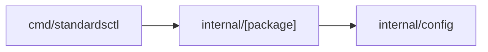

# Architecture Infocard Generator (`infocard-generate`)

Produce compact, standardized, single-page architecture infocards summarizing any package, service, or archetype in cordanaLLM ecosystem.

## Standard Infocard Template

Generate cards adhering to this structure (outer fence = 4 backticks, so inner fences stay inside template):

````markdown
# Component Infocard: [Component Name]

> **Path**: `internal/[package]`  
> **Profile**: `framework` | **Facets**: `security:high`, `api:public-contract`  
> **Maintainer**: cordanaLLM  

---

### 1. Functional Purpose
[A single concise paragraph explaining the exact responsibility of this component, its business value, and why it exists.]

---

### 2. Invariants & Strictness Bounds

| Invariant | Value | Enforcement Tool |
| :--- | :--- | :--- |
| **Max Cyclomatic** | $\le 10$ | `gocyclo` (golangci-lint) |
| **Max Func LOC** | $\le 75$ | `funlen` (golangci-lint), `internal/hiss` `go_ast.go` |
| **Memory Model** | Standard Heap / Zero Frame Malloc | Manual review (HISS-03, extended spec only; no gate) |
| **Error Ban** | Zero unwraps / All errors wrapped | `errcheck`, `errorlint` (golangci-lint), `internal/hiss` HISS-07 |
| **Call Graph** | Strict DAG (No Recursion) | `internal/hiss` `go_callgraph.go` (HISS-01) |

---

### 3. Public Surface & Interface Contracts
- `TypeOrInterface`: Summary of exported contract.
- `FuncSignature(ctx context.Context, ...) (Result, error)`: Key entrypoint.

---

### 4. Dependency Topology (DAG)


---

### 5. Deterministic Verification Receipt
Execute local validation:
```bash
go test -v -race ./internal/[package]/...
```
````

## When to Generate
- After implementing or modifying `internal/` package.
- When publishing new archetype or facet to `.config/archetypes/`.
- During agent context onboarding to provide subagents with localized mental models.
