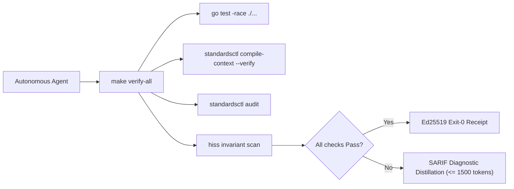

# cordanaLLM/praetor Agent Operating Harness

Run verification before concluding any turn:
```bash
make verify-all
```



## Core Directives & Invariants

| Invariant | Scope | Enforcement Mechanism | Failure Action |
| :--- | :--- | :--- | :--- |
| **HISS-01** | Control Flow | Recursion strictly prohibited; call graph must be DAG. | Immediate build failure |
| **HISS-02** | Loops & I/O | Scalar upper bound on all loops; explicit `context.Context` timeout on all I/O. | Semgrep / AST error |
| **HISS-04** | Complexity | McCabe Cyclomatic $\le 10$, Cognitive $\le 15$, Func LOC $\le 75$, Statements $\le 50$. | AST sweep blocker |
| **HISS-07** | Error Handling | Zero `.unwrap()` / `.expect()`; all errors handled or wrapped with context. | Linter / Compiler error |
| **HISS-10** | Warning Hygiene | Zero-warning tolerance across compiler, linter, and format sweeps. | Exit code 1 |
| **HISS-15** | 3D Testing | Positive, negative, and boundary tests mandatory for all public interfaces. | CI coverage gate |
| **HISS-16** | Context Integrity | Single canonical `AGENTS.md`; vendor files compiled via `standardsctl compile-context`. | Pre-commit blocker |
| **HISS-17** | State Ledger Discipline | Agent turn-start inspects `.workingdir/STATE.md` & `.workingdir/OPEN.md`; tasks tracked via `standardsctl state task`; turn-end `standardsctl state sync .` required. | Pre-commit / CI gate |

## Operational Rules

1. **Act on Verified State**:
   Read source files and run real commands before hypothesizing or editing. Never guess flag names, library signatures, or repo configurations from memory.

2. **Lead with Output**:
   Provide direct answers, diffs, and commands. Avoid filler preambles, "Based on", restatements, or conversational chatter.

3. **Context Transpiler First**:
   Never edit `CLAUDE.md`, `.cursor/rules/*.mdc`, `.windsurfrules`, or `.github/copilot-instructions.md` manually. Make all agent instruction updates in `AGENTS.md` and execute:
   ```bash
   standardsctl compile-context
   ```

4. **SARIF Diagnostic Distillation**:
   When reporting compiler or linter errors, distill output to $\le 1,500$ tokens ($< 60$ lines). Print the top 3 root-cause failures with file/line pointers and write full SARIF logs to ephemeral storage.

5. **No Evasion Tolerated**:
   Do not attempt `--no-verify`, `LEFTHOOK=0`, or modifying `.git/hooks`. All pull requests are authoritatively re-checked in an ephemeral isolated sandbox by `cordana-standards[bot]`.

6. **Anti-Loop Interception**:
   If the same AST diff and error category repeats $\ge 3$ times, halt execution immediately. Re-evaluate the underlying design instead of making micro-textual retries.

7. **State Ledger Discipline (HISS-17)**:
   Agents MUST maintain the local `.workingdir` session state ledger on every turn:
   - **Turn Start**: Inspect `.workingdir/STATE.md` and `.workingdir/OPEN.md` (or run `praetorctl state status`).
   - **During Work**: Register discrete tasks via `praetorctl state task add "<desc>"`, mark progress with `praetorctl state task complete "<selector>"`, and archive finished items with `praetorctl state task archive`.
   - **Turn End**: Execute `praetorctl state sync .` to record working tree status, dirty count, open tasks, and cryptographic state hash into `STATE.md`.

## Primary Verification Commands

```bash
# Full local test suite with race detector
go test -v -race ./...

# Recompile and verify cross-agent context outputs
go run ./cmd/standardsctl compile-context --verify

# Audit repository against declared HISS-16 standards
go run ./cmd/standardsctl audit

# Audit workstation directory topology compliance (DEV-01 to DEV-05)
go run ./cmd/standardsctl topology audit /home/kilian/dev

# Run all formatting, linting, and security gates
make verify-all
```

