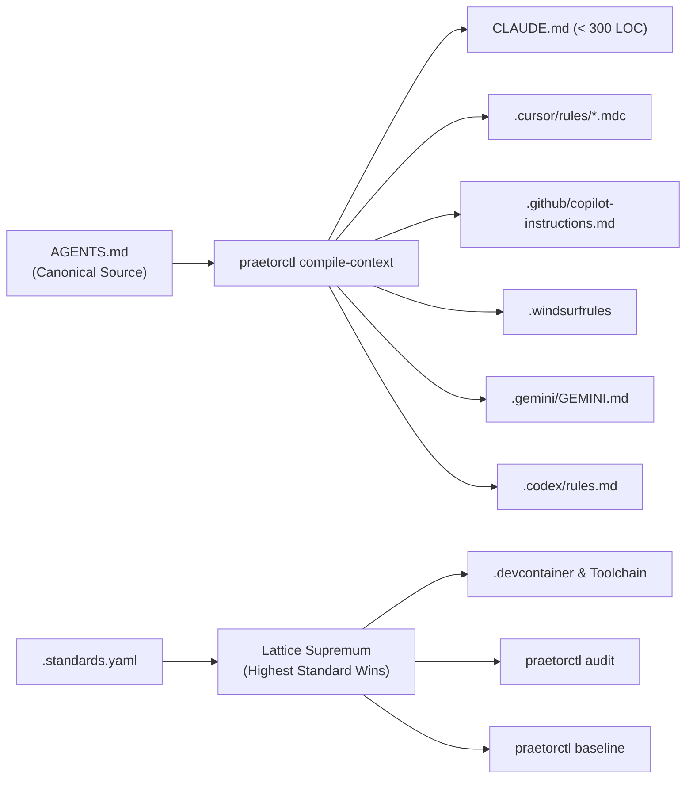

<div align="center">

  

  # ⚖️ Praetor

  **Enterprise Fleet Governance, Repository-as-Code & Universal AI Agent Engineering Engine**

  *Part of the [CordanaLLM](https://github.com/CordanaLLM) Deterministic Infrastructure Ecosystem*

  [](https://golang.org)
  [](https://cordanallm.github.io/praetor/standards/hiss-spec/)
  [](https://github.com/sponsors/CordanaLLM)
  [](https://ko-fi.com/cordana)
  [](https://modelcontextprotocol.io)
  [](https://cordanallm.github.io/praetor/llms.txt)
  [](LICENSES/EUPL-1.2.txt)

  <br />

  

</div>


---

## 🏛️ Executive Summary

**Praetor** is the flagship execution and governance engine of the **CordanaLLM** ecosystem. Built in Go 1.27+, Praetor transforms repository governance into a deterministic, active platform capability by combining **Repository-as-Code** orchestration, **context transpilation** across vendor-specific AI tools, and unbypassable **HISS (High-Integrity Systems Standard)** invariant enforcement.

While traditional repositories suffer from configuration drift and agentic fragmentation, Praetor maintains a single canonical source of truth—**`AGENTS.md`**—and compiles it into vendor-specific harnesses (`.claude`, `.cursor/rules/*.mdc`, `.windsurfrules`, `.gemini/GEMINI.md`, `.github/copilot-instructions.md`, `.codex/rules.md`) while ensuring mathematical code quality and debt ratcheting.

---

## 💖 Support & Sponsorship

Praetor and the CordanaLLM ecosystem are open-source, high-integrity infrastructure projects built to bring mathematical rigor to autonomous AI agents. If Praetor saves you engineering hours, secures your AI fleet, or powers your workflows, consider supporting further development!

<div align="center">

  <a href="https://github.com/sponsors/CordanaLLM">
    
  </a>
  &nbsp;&nbsp;&nbsp;&nbsp;
  <a href="https://polar.sh/CordanaLLM">
    
  </a>
  &nbsp;&nbsp;&nbsp;&nbsp;
  <a href="https://opencollective.com/cordanallm">
    
  </a>

</div>

*Every contribution directly fuels independent AI safety research, Go toolchain development, and HISS verification engines.*

---

## 📐 Architecture & Transpilation Flow

Praetor resolves context compilation and lattice configuration through a single-pass DAG pipeline:



---

## 🚀 Key Capabilities & Architectural Pillars

| Architectural Pillar | Technical Functionality | Primary Tooling |
| :--- | :--- | :--- |
| **Universal Context Transpiler** | Single canonical `AGENTS.md` compiled into vendor targets ($\le 300$ lines for `CLAUDE.md`). | `praetorctl compile-context` |
| **Multi-Transport MCP Bridge** | `stdio`, Streamable HTTP, and SSE Model Context Protocol server with tool schema translation. | `standards-mcp` |
| **HISS Lattice Engine** | Composable archetypes resolved via Join-Semilattice supremum ("Highest Standard Wins"). | `internal/config` |
| **Hermetic Devcontainers** | Reproducible multi-architecture dev environments pre-wiring toolchains and Editor setups. | `praetorctl devcontainer` |
| **Monotonic Debt Ratcheting** | Baselined legacy debt with non-increasing debt invariants and touched-file clean rules. | `praetorctl baseline` |
| **Supply Chain Provenance** | SLSA Level 3 attestations, Syft SBOMs, and Sigstore Cosign keyless signatures. | GoReleaser + Actions OIDC |
| **Dual-Surface Documentation** | Material-for-MkDocs human UI paired with token-efficient `/llms.txt` and `/llms-full.txt` endpoints. | `mkdocs-llmstxt-md` |

---

## 🛡️ HISS Architectural Invariants

Praetor enforces the **High-Integrity Systems Standard (HISS)**—adapting NASA-JPL flight-software rigor to modern Go engineering:

* **HISS-01 (Acyclic Control Flow)**: Recursion is strictly prohibited; call graph must be a DAG.
* **HISS-02 (Bounded Loops & Timeouts)**: Bounded iterations and explicit context deadlines on all network and disk I/O.
* **HISS-04 (Complexity & Function Length Caps)**: Maximum McCabe cyclomatic complexity $M \le 10$, function length $\le 75$ LOC.
* **HISS-07 (Zero Unchecked Errors)**: Zero unchecked error values and zero `.unwrap()` or unhandled panic calls in production.
* **HISS-10 (Zero-Warning Cascade)**: 5-layer zero-warning cascade from editor to deployment admission controller.
* **HISS-15 (3D Testing Discipline)**: Positive, negative, and boundary tests mandatory for all public APIs.
* **HISS-16 (Canonical Operating Harness)**: Single canonical `AGENTS.md` harness with unbypassable server-authoritative verification.

---

## 📂 Repository Layout

```text
.
├── .agents/skills/             # Universal agent skill declarations
├── .claude/                    # Target compilation for Claude Code (CLAUDE.md)
├── .codex/                     # Target compilation for OpenAI Codex
├── .config/                    # System & linter configurations
├── .cursor/rules/              # Compiled Cursor MDC rulesets
├── .devcontainer/              # Hermetic multi-arch devcontainer definitions
├── .gemini/                    # Target compilation for Gemini CLI / Antigravity IDE
├── .github/                    # Workflows, Copilot instructions, and release configs
├── .vscode/                    # Shared editor settings and launch profiles
├── cmd/                        # Go application entrypoints
│   ├── standardsctl/           # Governance CLI (compile, audit, baseline)
│   └── standards-mcp/          # Multi-transport MCP server
├── docker/dev/                 # Developer environment container builds
├── docs/                       # Dual-Surface MkDocs documentation & assets
│   └── assets/                 # Branding assets (banners, logos, icons, favicons)
├── editors/                    # Vendor editor integrations & LSP configs
├── internal/                   # Core Go packages (config, lattice, AST transpiler)
├── lua/ & .nvim.lua            # Neovim native governance integrations
├── .needs.yaml                 # Golusoris framework capability declarations
├── .standards.yaml             # Primary repository governance specification
├── .standards.lock             # Immutable locked dependency & profile state
├── .standards-baseline.json    # Debt ratcheting baseline state
├── AGENTS.md                   # Canonical AI Agent harness (Source of Truth)
├── Makefile                    # Universal verification & build entrypoint
└── go.mod & go.sum             # Go module dependencies (Go 1.27+)
```

---

## ⚡ Quickstart & Developer Workflow

### 1. Universal Verification Gate
Run the universal verification pipeline across the entire Go codebase and governance rules:
```bash
make verify-all
```

### 2. Context Transpilation
Update agent instructions in `AGENTS.md` and transpile to all vendor targets (`.claude`, `.cursor`, `.windsurf`, `.gemini`, `.codex`, `.github`):
```bash
# Transpile context files
go run ./cmd/standardsctl compile-context

# Assert that all target context files are 100% in sync (CI check)
go run ./cmd/standardsctl compile-context --verify
```

### 3. Repository Governance Audit
Inspect repository compliance against declared profiles and the HISS baseline:
```bash
go run ./cmd/standardsctl audit
```

### 4. Technical Debt Ratcheting
Freeze current debt baselines to enforce monotonic debt reduction on touched files:
```bash
go run ./cmd/standardsctl baseline
```

---

## 📜 License & Compliance

Distributed under the **European Union Public Licence 1.2 (EUPL-1.2)**. See
[`LICENSE`](LICENSE) for the full text and [`REUSE.toml`](REUSE.toml) for SPDX
licensing metadata.

Part of the **[CordanaLLM](https://github.com/CordanaLLM)** project.
