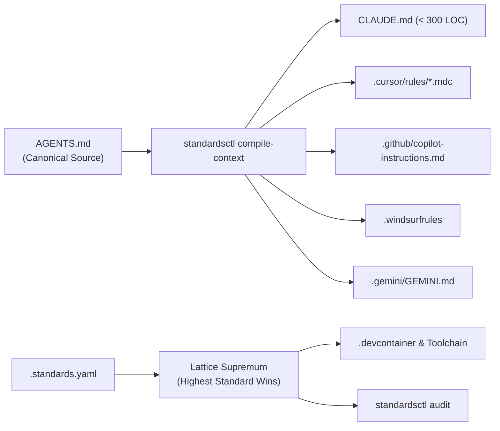

# cordanaLLM/standards

[](https://github.com/cordanaLLM/standards)
[](LICENSE)
[](https://goreportcard.com/report/github.com/cordanaLLM/standards)
[](https://slsa.dev)
[](.standards.lock)

Enterprise Fleet Governance, Repository-as-Code & Universal AI Agent Engineering Engine.



---

## Key Capabilities

| Architectural Pillar | Core Functionality | Primary Tool |
| :--- | :--- | :--- |
| **Context Transpiler** | Single canonical `AGENTS.md` compiled into vendor targets ($< 300$ lines). | `standardsctl compile-context` |
| **Multi-Transport MCP** | `stdio`, `HTTP`, and `SSE` MCP server with native tool schema translation. | `standards-mcp` |
| **HISS-16 Lattice** | Composable archetypes resolved via Join-Semilattice supremum ("Highest Standard Wins"). | `internal/config` |
| **Hermetic Devcontainers** | Reproducible multi-architecture development environments pre-wiring toolchains. | `standardsctl devcontainer` |
| **Debt Ratcheting** | Baselined legacy debt with monotonic decrease invariant and touched-file clean rule. | `standardsctl baseline` |
| **Supply Chain Provenance**| SLSA Level 3 in-toto attestations, Syft SBOMs, and Sigstore Cosign keyless signatures. | GoReleaser + Actions OIDC |

---

## Quickstart

### 1. Verification Entrypoint
Run the universal verification gate across your repository:
```bash
make verify-all
```

### 2. Context Transpilation
Update agent instructions in `AGENTS.md` and transpile all vendor targets:
```bash
# Transpile context files
go run ./cmd/standardsctl compile-context

# Assert that all targets are 100% in sync
go run ./cmd/standardsctl compile-context --verify
```

### 3. Repository Governance Audit
Inspect repository compliance against declared profiles and the HISS-16 baseline:
```bash
go run ./cmd/standardsctl audit
```

---

## Architectural Invariants (HISS-16)

- **HISS-01**: Acyclic control flow. Recursion is strictly prohibited; call graph must be a DAG.
- **HISS-02**: Bounded loops and explicit context deadlines on all network and disk I/O.
- **HISS-04**: Maximum McCabe cyclomatic complexity $\le 10$, function length $\le 75$ LOC.
- **HISS-07**: Zero unchecked errors and zero `.unwrap()` in production code.
- **HISS-10**: 5-layer zero-warning cascade from editor to deployment admission controller.
- **HISS-15**: 3D testing discipline: positive, negative, and boundary tests mandatory for all public APIs.
- **HISS-16**: Single canonical `AGENTS.md` operating harness; unbypassable server-authoritative verification.

---

## License

Apache License 2.0. See [LICENSE](LICENSE) for details.

