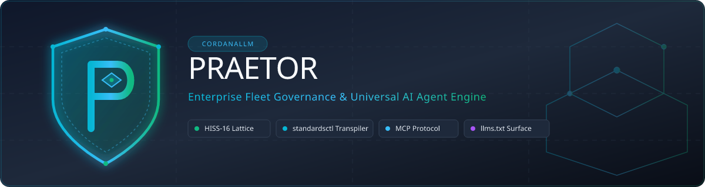
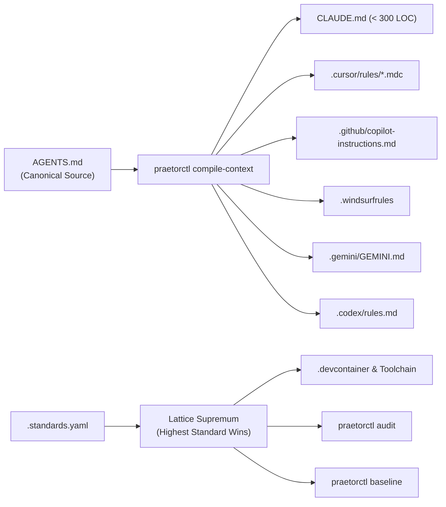

<div align="center">

  

# ⚖️ Praetor

  <strong>Enterprise Fleet Governance, Repository-as-Code & Universal AI Agent Engineering Engine</strong>

  *Part of the [CordanaLLM](https://github.com/CordanaLLM) Deterministic Infrastructure Ecosystem*

  [](https://golang.org)
  [](https://cordanallm.github.io/praetor/standards/hiss-spec/)
  [](https://modelcontextprotocol.io)
  [](https://cordanallm.github.io/praetor/llms.txt)
  [](LICENSES/EUPL-1.2.txt)
  <!-- praetor:funding-badges:start -->
  <!-- praetor:funding-badges:end -->

  <br />

  

</div>

<!-- praetor:readme-governance:start -->
[](https://github.com/cordanaLLM/praetor/actions/workflows/praetor-docs.yml)

Praetor manages this repository's declared governance policy. This managed block records adoption state; it is not a verification certificate.

| Gate | Command | Contract |
| :--- | :--- | :--- |
| **Verification** | `make verify-all` | Runs the repository's configured verification cascade |
| **HISS Audit** | `praetorctl audit` | Enforces policy, generated-surface integrity, and the debt ratchet |
| **Context Sync** | `praetorctl compile-context --verify` | Verifies every generated agent context against `AGENTS.md` |
| **Documentation** | `make docs-lint` | Enforces locked Markdown style and private scratch-link policy |
| **Debt Baseline** | `.standards-baseline.json` | 0 recorded infractions; audit forbids growth |
<!-- praetor:readme-governance:end -->

---

## 🏛️ Executive Summary

**Praetor** is the flagship execution and governance engine of the **CordanaLLM** ecosystem. Built in Go 1.27+, Praetor transforms repository governance into a deterministic, active platform capability by combining **Repository-as-Code** orchestration, **context transpilation** across vendor-specific AI tools, and unbypassable **HISS (High-Integrity Systems Standard)** invariant enforcement.

While traditional repositories suffer from configuration drift and agentic fragmentation, Praetor maintains a single canonical source of truth—**`AGENTS.md`**—and compiles it into vendor-specific harnesses (`.claude`, `.cursor/rules/*.mdc`, `.windsurfrules`, `.gemini/GEMINI.md`, `.github/copilot-instructions.md`, `.codex/rules.md`) while ensuring mathematical code quality and debt ratcheting.

---

<!-- praetor:funding-support:start -->
<!-- praetor:funding-support:end -->

## 📐 Architecture & Transpilation Flow

Praetor resolves context compilation and lattice configuration through a single-pass DAG pipeline:


```mermaid
flowchart LR
    AGENTS["AGENTS.md\n(Canonical Source)"] --> COMP["praetorctl compile-context"]
    COMP --> C1["CLAUDE.md (< 300 LOC)"]
    COMP --> C2[".cursor/rules/*.mdc"]
    COMP --> C3[".github/copilot-instructions.md"]
    COMP --> C4[".windsurfrules"]
    COMP --> C5[".gemini/GEMINI.md"]
    COMP --> C6[".codex/rules.md"]
    
    STANDARDS[".standards.yaml"] --> LATTICE["Lattice Supremum\n(Highest Standard Wins)"]
    LATTICE --> DEV[".devcontainer & Toolchain"]
    LATTICE --> AUDIT["praetorctl audit"]
    LATTICE --> BASE["praetorctl baseline"]
```

---

## 🚀 Key Capabilities & Architectural Pillars

| Architectural Pillar | Technical Functionality | Primary Tooling |
| :--- | :--- | :--- |
| **Universal Context Transpiler** | Single canonical `AGENTS.md` compiled into vendor targets ($\le 300$ lines for `CLAUDE.md`). | `praetorctl compile-context` |
| **Multi-Transport MCP Server** | `stdio`, Streamable HTTP, and SSE Model Context Protocol server; every tool result and error passes the prompt-injection neutralizer before it is served (`internal/mcp/sanitize.go`). | `standards-mcp` |
| **HISS Lattice Engine** | Composable archetypes resolved via Join-Semilattice supremum ("Highest Standard Wins"). | `internal/config` |
| **Hermetic Devcontainers** | Reproducible multi-architecture dev environments pre-wiring toolchains and Editor setups. | `praetorctl devcontainer` |
| **Monotonic Debt Ratcheting** | Baselined legacy debt with non-increasing debt invariants and touched-file clean rules. | `praetorctl baseline` |
| **Supply Chain Provenance** | Syft SBOMs (CycloneDX + SPDX) and Sigstore Cosign keyless signatures over them via OIDC; `praetorctl provenance` separately emits an unsigned SLSA v1.0 statement for a given artifact file, on demand. | GoReleaser + Cosign + Syft |
| **Dual-Surface Documentation** | Material-for-MkDocs human UI paired with a concise `/llms.txt` index and source-bound `/llms-full.txt` compatibility map. | `make docs-lint` catalog parity |

---

## 🛡️ HISS Architectural Invariants

Praetor enforces the **High-Integrity Systems Standard (HISS)**—adapting NASA-JPL flight-software rigor to modern Go engineering:

* **HISS-01 (Acyclic Control Flow)**: Recursion is strictly prohibited; call graph must be a DAG.
* **HISS-02 (Bounded Loops & Timeouts)**: Bounded iterations and explicit context deadlines on all network and disk I/O.
* **HISS-04 (Complexity & Function Length Caps)**: Maximum McCabe cyclomatic complexity $M \le 10$, cognitive complexity $\le 15$, function length $\le 75$ LOC, $\le 50$ executable statements.
* **HISS-07 (Zero Unchecked Errors)**: Zero unchecked error values and zero `.unwrap()` or unhandled panic calls in production.
* **HISS-10 (Zero-Warning Cascade)**: 5-layer zero-warning cascade from editor to deployment admission controller.
* **HISS-15 (3D Testing Discipline)**: Positive, negative, and boundary tests mandatory for all public APIs.
* **HISS-16 (Canonical Operating Harness)**: Single canonical `AGENTS.md` harness with unbypassable server-authoritative verification.
* **HISS-17 (State Ledger Discipline)**: Every agent turn reads and updates the local `.workingdir` ledger instead of re-deriving state from scratch.
* **HISS-18 (Diff-Aware CI Efficiency)**: `praetorctl ci filter` classifies each change so a docs- or state-only diff skips the heavy race and security gates.
* **HISS-19 (Reuse Before Writing)**: One behavior has exactly one implementation; `praetorctl dedupe scan` enforces it as a clone and utility-sprawl gate.
* **HISS-20 (Replayable Enforcement Evidence)**: Every coverage claim in `.config/hiss/coverage.yaml` is replayed against a fixture corpus in both directions, never merely asserted.
* **HISS-21 (Platform Neutrality)**: A gate runs on Linux, macOS and Windows, or skips with a stated reason; a gate that cannot run is not a passing gate.

See the [HISS specification](docs/standards/hiss-spec.md) for the full invariant catalog, including the supply-chain and memory-safety invariants (HISS-03, 08, 09, 11, 14) this summary omits.

---

## 📂 Repository Layout

```text
.
├── .agents/skills/             # Universal agent skill declarations
├── .claude/                    # Target compilation for Claude Code (CLAUDE.md)
├── .codex/                     # Target compilation for OpenAI Codex
├── .config/                    # System & linter configurations
├── .cursor/rules/              # Compiled Cursor MDC rulesets
├── .devcontainer/              # Hermetic multi-arch devcontainer definitions
├── .gemini/                    # Target compilation for Gemini CLI / Antigravity IDE
├── .github/                    # Workflows, Copilot instructions, and release configs
├── .vscode/                    # Shared editor settings and launch profiles
├── cmd/                        # Go application entrypoints
│   ├── standardsctl/           # Governance CLI (compile, audit, baseline)
│   └── standards-mcp/          # Multi-transport MCP server
├── docker/dev/                 # Developer environment container builds
├── docs/                       # Dual-Surface MkDocs documentation & assets
│   └── assets/                 # Branding assets (banners, logos, icons, favicons)
├── editors/                    # Vendor editor integrations & LSP configs
├── internal/                   # Core Go packages (config, lattice, AST transpiler)
├── lua/ & .nvim.lua            # Neovim native governance integrations
├── .needs.yaml                 # Golusoris framework capability declarations
├── .standards.yaml             # Primary repository governance specification
├── .standards.lock             # Immutable locked dependency & profile state
├── .standards-baseline.json    # Debt ratcheting baseline state
├── AGENTS.md                   # Canonical AI Agent harness (Source of Truth)
├── Makefile                    # Universal verification & build entrypoint
└── go.mod & go.sum             # Go module dependencies (Go 1.27+)
```

---

## ⚡ Quickstart & Developer Workflow

### 1. Universal Verification Gate

Run the universal verification pipeline across the entire Go codebase and governance rules:

```bash
make verify-all

# Run the locked public Markdown and private scratch-link gate alone
make docs-lint
```

The [documentation governance guide](docs/guides/documentation-governance.md)
defines the checked inventory, locked rules, CI/adoption contract, and remediation
for private `.workingdir/` or `.workingdir2/` destinations.

### 2. Context Transpilation

Update agent instructions in `AGENTS.md` and transpile to all vendor targets (`.claude`, `.cursor`, `.windsurf`, `.gemini`, `.codex`, `.github`):

```bash
# Transpile context files
go run ./cmd/standardsctl compile-context

# Assert that all target context files are 100% in sync (CI check)
go run ./cmd/standardsctl compile-context --verify
```

### 3. Repository Governance Audit

Inspect repository compliance against declared profiles and the HISS baseline:

```bash
go run ./cmd/standardsctl audit
```

### 4. Technical Debt Ratcheting

Freeze current debt baselines to enforce monotonic debt reduction on touched files:

```bash
go run ./cmd/standardsctl baseline
```

---

## 📜 License & Compliance

Distributed under the **European Union Public Licence 1.2 (EUPL-1.2)**. See
[`LICENSE`](LICENSE) for the full text and [`REUSE.toml`](REUSE.toml) for SPDX
licensing metadata.

Part of the **[CordanaLLM](https://github.com/CordanaLLM)** project.
