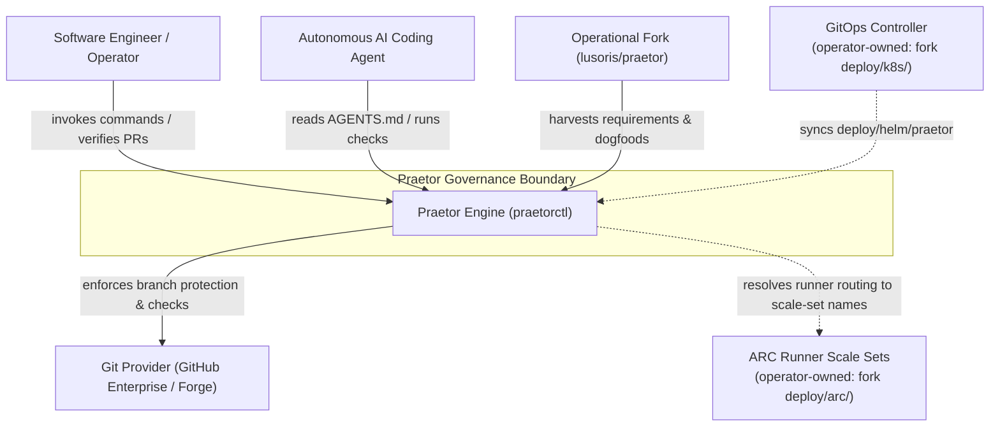
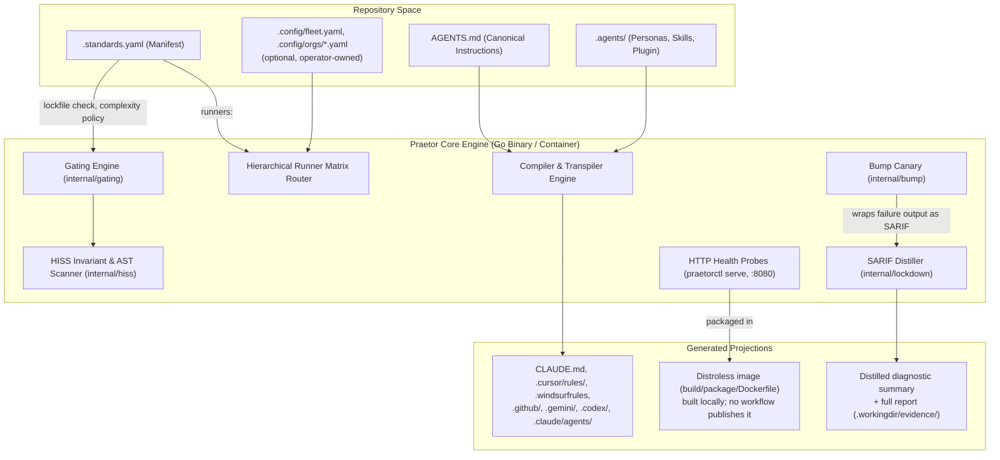
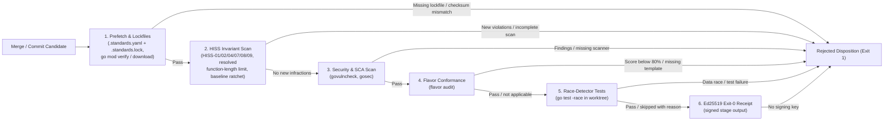

# Praetor Architecture: C4 Models & System Lattice

This document specifies the architectural topology of the Praetor Governance Engine using C4 modeling and Mermaid diagrams.

---

## 1. Level 1: System Context Diagram

The System Context diagram details Praetor's boundaries, autonomous agent interactions, git providers, and downstream cluster infrastructure.

Dashed edges cross into infrastructure this repository does not ship. The ARC scale sets and the
ArgoCD Application are operator data: `deploy/arc/` and `deploy/k8s/` are owner-only paths
(`ownerOnlyPrefixes` in `internal/operationalsync/overlay.go`) that exist only in the operational
fork, and the engine's `.gitignore` ignores them (`TestOwnerOnlyPrefixesAreIgnoredByTheEngine` in
`internal/operationalsync/owner_only_test.go`). Praetor does not dispatch jobs: `praetorctl audit`
checks that the runner policy resolves (`auditRunnerMatrix` in `cmd/standardsctl/audit.go`), and
this repository's workflows run on GitHub-hosted runners.

---

## 2. Level 2: Container Diagram

The Container diagram illustrates the runtime modules within the Praetor binary, daemon services, and configuration inputs.

The HISS scanner returns a `ScanReport` to the gate and to `praetorctl audit`; it emits no SARIF.
SARIF enters through `lockdown.DistillSARIF`, which condenses a SARIF log (today the bump canary's
wrapped test failure, `internal/bump/canary.go`) into a bounded summary and writes the full report
under `.workingdir/evidence/`. The gate reads `.standards.yaml` twice: the prefetch stage requires it
and `.standards.lock` to exist, and the HISS stage scans with the function-length limit its policy
resolves to. The Helm chart's default image reference (`deploy/helm/praetor/values.yaml`) names a
`ghcr.io` tag that no workflow publishes (ADR-0012, decision 4).

---

## 3. Level 3: Component Diagram (Gating Engine)

The Component diagram details the internal workflow of the Anti-Direct-Merge Gating Pipeline (`internal/gating/pipeline.go`).

Stage order and names come from `executeStages` in `internal/gating/pipeline.go`; a dry run skips
stage 5 and mints no receipt. ADR-0012 (decision 3) records the pipeline; ADR-0004's four-stage
description is superseded.
