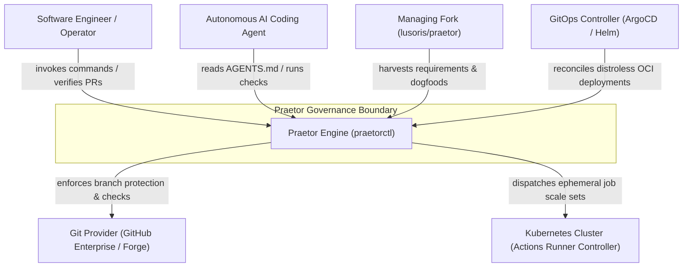
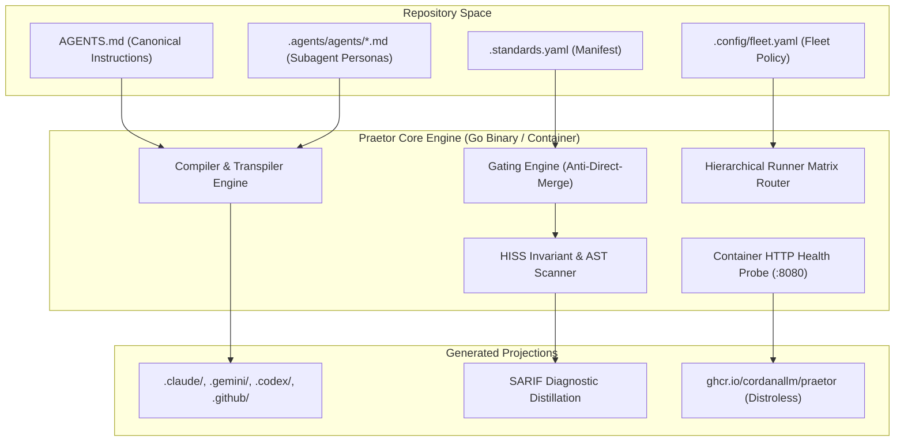
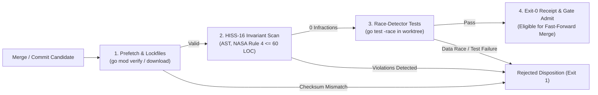

# Praetor Architecture: C4 Models & System Lattice

This document specifies the architectural topology of the Praetor Governance Engine using C4 modeling and Mermaid diagrams.

---

## 1. Level 1: System Context Diagram

The System Context diagram details Praetor's boundaries, autonomous agent interactions, git providers, and downstream cluster infrastructure.

---

## 2. Level 2: Container Diagram

The Container diagram illustrates the runtime modules within the Praetor binary, daemon services, and configuration inputs.

---

## 3. Level 3: Component Diagram (Gating Engine)

The Component diagram details the internal workflow of the Anti-Direct-Merge Gating Pipeline (`internal/gating/pipeline.go`).

