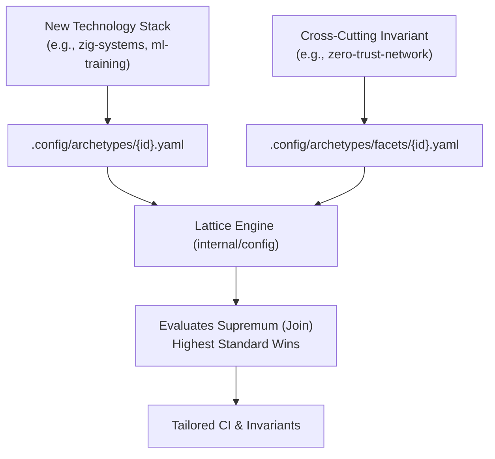

# Archetype and Facet Authoring Guide

Learn how to define new composable profiles and cross-cutting security/operational facets in `cordanaLLM/praetor`.



---

## 0. The shipped catalog

Fourteen profiles ship in `.config/archetypes/`:

`app-service` · `closed-private` · `container-image` · `framework` · `gitops-infra` ·
`library-client` · `native-gpu-systems` · `org-health` · `os-image` · `pages-site` ·
`planning-artifacts` · `template-seed` · `upstream-fork` · `web-package`

Six facets ship in `.config/archetypes/facets/`.

**A profile is not a flavor.** A profile says what governance applies; a flavor says which templates,
settings and toolchains a repository of that kind requires. Five profiles currently have any flavor
implementing them — `app-service`, `framework`, `native-gpu-systems`, `container-image` and
`os-image`. For the other nine, `flavor audit` reports **not applicable** rather than measuring the
repository against an inferred language flavor.

### The `os-image` flavor: a forge is what it builds

`os-image` is the first profile whose flavor is not a language stack. It requires `packer`,
`shellcheck` and `yamllint`, plus a `.yamllint.yml` policy for the image and workflow definitions,
because an image forge is audited on the pipeline that produces a bootable artifact rather than on a
compiler toolchain.

**What marks a forge.** Three markers, in `internal/flavor/definitions.go` and in the unified
classification table in `internal/classify/classify.go`:

| Marker | Kind | What it identifies |
| :--- | :--- | :--- |
| `packer/*.pkr.hcl` | glob | a Packer template tree |
| `mkosi.conf` | fixed path | an mkosi image definition |
| `build/mkosi.conf` | fixed path | the same, under a build directory |

**The glob marker rule.** Most markers are a fixed path: `go.mod` either exists or it does not. A
Packer tree cannot be written that way, because what identifies the forge is holding *some*
template, not a particular one. `util.MarkerExists` is the single matcher for both tables: a fixed
marker stays a `stat`, a pattern containing `*`, `?` or `[` expands with a bounded scan
(`maxMarkerMatches = 256`, HISS-02) and counts **only regular files**. That last part is what keeps
the negatives honest — an empty `packer/`, a `packer/` holding only a `README.md`, and a *directory*
named `x.pkr.hcl` are all non-matches, so no repository becomes an image forge by owning a folder. A
malformed pattern matches nothing rather than erroring: a marker table describes the world, it is
not user input to validate.

**Why it outranks `go.mod` and `pyproject.toml`.** `OSImageFlavor` is registered ahead of the
language flavors, and its markers sit ahead of `go.mod` and `pyproject.toml` in `classify.rules()`.
An image forge carries both — a Go CLI that drives the build, a Python suite that verifies the
result — so whichever language flavor claimed it first would describe the *tooling* instead of the
*product*. That is not hypothetical: `cordanaLLM/imago` was audited as a Go service and told to add
a Dockerfile it has no use for. Order the markers the same way when you add a profile whose
repositories are known by their output rather than their source language.

### JavaScript flavors: flat ESLint config, never a second one

`typescript-node` and `frontend-svelte` require ESLint configuration through one shared definition in
`internal/flavor/eslint.go`:

- **What counts as configured.** Any file ESLint already loads: `eslint.config.{js,mjs,cjs,ts,mts,cts}`,
  or a legacy `.eslintrc`, `.eslintrc.{js,cjs,json,yaml,yml}`. A repository carrying one conforms, and
  `flavor apply` writes nothing beside it unless `--force` is passed.
- **What gets scaffolded.** Only for a repository with none of those: `eslint.config.mjs`, holding
  ESLint's recommended JavaScript rules in the form the `@eslint/js` README documents. It is `.mjs`
  because a `.js` file is ESM or CommonJS depending on `package.json` `"type"`, and `.mjs` loads in
  both kinds of repository.
- **What is never scaffolded.** Legacy eslintrc files. ESLint v10 cannot load them, which is why the
  shipped catalog already refuses to name them (`internal/config/shipped_catalog_test.go`).

Two guards in `internal/flavor/eslint_guard_test.go` hold every flavor to this. One fails if any flavor
requires a legacy eslintrc file. The other fails if any JavaScript or TypeScript template has no content
of its own and falls through to the `# ... configuration` default, because `#` is a syntax error in
those languages. `frontend-svelte`'s `playwright.config.ts` now carries the configuration the
`@playwright/test` documentation shows, without a `baseURL` or `webServer`, since those depend on an
application server the flavor cannot know about.

Two profiles are worth reading before writing a new one, because their correctness looks like a
mistake:

- **`upstream-fork`** declares every complexity bound as `0` and disables linear history and signed
  commits. A contribution fork must match the upstream it submits to, so a gate that rewrites the
  tree makes every patch unmergeable. The looseness is the feature.
- **`org-health`** requires one approving reviewer rather than two despite its blast radius, because
  the repositories that need it are the least maintained ones and a two-approval rule on a
  repository nobody watches is how it goes stale.

## 1. Profile Definition Anatomy

Profiles represent the primary technology stack or architecture. Create `.config/archetypes/{profile-id}.yaml`:

```yaml
id: "native-gpu-systems"
name: "Native GPU & Compute Systems"
description: "High-performance C/C++/Rust/Vulkan systems with deterministic memory bounds"
runtime: "native"

complexity:
  max_cyclomatic: 10
  max_cognitive: 12
  max_func_loc: 75
  max_statements: 40

memory:
  zero_frame_malloc: true
  banned_alloc_in_ticks: true

linters:
  - "clang-tidy"
  - "clippy"
  - "semgrep"

devcontainer_features:
  - "ghcr.io/devcontainers/features/rust:1"
  - "ghcr.io/devcontainers/features/common-utils:2"
```

---

## 2. Facet Definition Anatomy

Facets are cross-cutting policy modifiers. Create `.config/archetypes/facets/{facet-id}.yaml`:

```yaml
id: "security:high"
name: "High-Security Provenance & Hardening"
description: "SLSA Level 3 attestations, keyless Cosign signatures, and non-root execution"

supply_chain:
  slsa_level: 3
  enforce_cosign: true
  require_sbom: true

branch_protection:
  enforce_linear_history: true
  require_signed_commits: true
  required_approving_reviewers: 2
  dismiss_stale_reviews: true
```

---

## 3. The Strictness Lattice ("Highest Standard Wins")

When two profiles or facets define conflicting parameters, the monotonic supremum is calculated:
$$\mathcal{P}_{\text{resolved}} = \mathcal{P}_1 \sqcup \mathcal{P}_2 \sqcup \dots \sqcup \mathcal{F}_n$$

- Lower complexity limits win ($\min$).
- Greater security reviews and higher SLSA levels win ($\max$).
- Linters and container features form a deduplicated set union ($\cup$).
