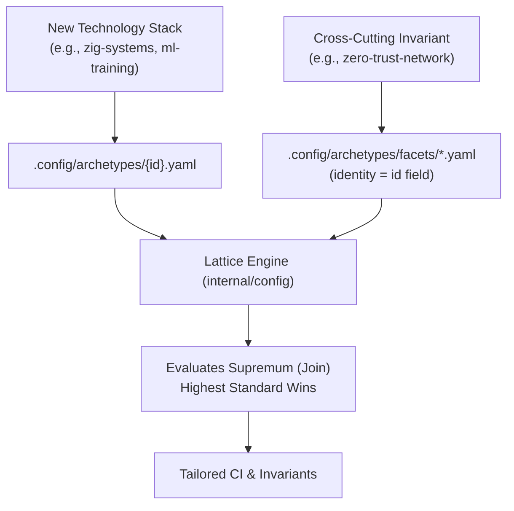

# Archetype and Facet Authoring Guide

Learn how to define new composable profiles and cross-cutting security/operational facets in `cordanaLLM/praetor`.



---

## 0. The shipped catalog

Fourteen profiles ship in `.config/archetypes/`:

`app-service` · `closed-private` · `container-image` · `framework` · `gitops-infra` ·
`library-client` · `native-gpu-systems` · `org-health` · `os-image` · `pages-site` ·
`planning-artifacts` · `template-seed` · `upstream-fork` · `web-package`

Six facets ship in `.config/archetypes/facets/`.

**A profile is not a flavor.** A profile says what governance applies; a flavor says which templates,
settings and toolchains a repository of that kind requires. Five profiles currently have any flavor
implementing them — `app-service`, `framework`, `native-gpu-systems`, `container-image` and
`os-image`. For the other nine, `flavor audit` reports **not applicable** rather than measuring the
repository against an inferred language flavor.

### Flavor templates: one embedded body, checked content

Every template a flavor requires states where its content comes from, in
`internal/flavor/definitions.go`, exactly one way:

| Field | Meaning | Example |
| :--- | :--- | :--- |
| `Source` | a body under `templates/`, compiled into the binary and rendered by `praetorctl flavor apply` | `go/ci-go.yml.tmpl` for `.github/workflows/ci.yml` |
| `Producer` | the command that writes the file; `flavor apply` never writes it, `--force` included, and lists it under *Left to Producer* | `praetorctl adopt` for `.standards.yaml`, `praetorctl compile-context` for `CLAUDE.md` |

A template with neither is an apply error, not a placeholder. `flavor apply` used to write a one-line
`# <file> configuration for <owner>/<repo>` comment for every template it had no body for, which
disabled every built-in gitleaks rule (#410) and scaffolded workflows that ran nothing.
`praetorctl flavor inspect <flavor>` prints the producer beside each producer-owned template.

**The body is the file.** `templates/embed.go` embeds `templates/*/*.tmpl`, so the file under
`templates/` is byte for byte what an adopter receives. Actions use `<%` and `%>` rather than `{{ }}`,
because the workflows carry GitHub expressions such as `${{ runner.os }}`; a maintainer note goes in a
template comment, `<%- /* note */ -%>`, which renders to nothing. The context a body can name is
`templates.Context`; a body naming anything else fails `TestEveryShippedTemplateRenders`
(`templates/embed_test.go`). `.clang-tidy` is shared with the Visual Studio editor target
(`internal/editor/editor.go`), so both commands write one configuration.

**The audit reads the content.** `flavor audit` counts a template only when it is a regular file —
not a directory, and a symbolic link only when it resolves inside the repository — whose content
passes the template's `Validator` (`internal/flavor/template_validators.go`). Settings share the same
reader. Each validator checks what its format makes checkable and no more:

| Validator | Accepts |
| :--- | :--- |
| `validWorkflow` | a workflow with a non-empty `jobs` mapping |
| `validDockerfile` | at least one `FROM` instruction |
| `validGitleaksConfig` | a config that loads rules: `[extend] useDefault = true`, an `[extend] path`, or `[[rules]]` |
| `assignsTOMLKey` | TOML assigning at least one key |
| `validXMLDocument` | well-formed XML with an element |
| `validMarkdownDocument` | text beyond headings and HTML comments |
| `validYAMLMapping`, `validJSONObject` | a non-empty mapping or object, as for settings |
| `carriesCode` | a line that is not a comment, for JavaScript, TypeScript and `tsconfig.json`, which is JSON with comments |

When you add a template, give it a `Source` (add the body under `templates/<ecosystem>/`) or a
`Producer`, and a `Validator`. `TestEveryRequiredTemplateStatesItsContent`
(`internal/flavor/template_content_test.go`) fails otherwise, and also fails when the scaffolded body
does not pass its own validator or the old comment placeholder does.

### The `os-image` flavor: a forge is what it builds

`os-image` is the first profile whose flavor is not a language stack. It requires `packer`,
`shellcheck` and `yamllint`, plus a `.yamllint.yml` policy for the image and workflow definitions,
because an image forge is audited on the pipeline that produces a bootable artifact rather than on a
compiler toolchain.

**What marks a forge.** Three markers, in `internal/flavor/definitions.go` and in the unified
classification table in `internal/classify/classify.go`:

| Marker | Kind | What it identifies |
| :--- | :--- | :--- |
| `packer/*.pkr.hcl` | glob | a Packer template tree |
| `mkosi.conf` | fixed path | an mkosi image definition |
| `build/mkosi.conf` | fixed path | the same, under a build directory |

**The glob marker rule.** Most markers are a fixed path: `go.mod` either exists or it does not. A
Packer tree cannot be written that way, because what identifies the forge is holding *some*
template, not a particular one. `util.MarkerExists` is the single matcher for both tables: a fixed
marker stays a `stat`, a pattern containing `*`, `?` or `[` expands with a bounded scan
(`maxMarkerMatches = 256`, HISS-02) and counts **only regular files**. That last part is what keeps
the negatives honest — an empty `packer/`, a `packer/` holding only a `README.md`, and a *directory*
named `x.pkr.hcl` are all non-matches, so no repository becomes an image forge by owning a folder. A
malformed pattern matches nothing rather than erroring: a marker table describes the world, it is
not user input to validate.

**Why it outranks `go.mod` and `pyproject.toml`.** `OSImageFlavor` is registered ahead of the
language flavors, and its markers sit ahead of `go.mod` and `pyproject.toml` in `classify.rules()`.
An image forge carries both — a Go CLI that drives the build, a Python suite that verifies the
result — so whichever language flavor claimed it first would describe the *tooling* instead of the
*product*. That is not hypothetical: `cordanaLLM/imago` was audited as a Go service and told to add
a Dockerfile it has no use for. Order the markers the same way when you add a profile whose
repositories are known by their output rather than their source language.

### JavaScript flavors: flat ESLint config, never a second one

`typescript-node` and `frontend-svelte` require ESLint configuration through one shared definition in
`internal/flavor/eslint.go`:

- **What counts as configured.** Any file ESLint already loads: `eslint.config.{js,mjs,cjs,ts,mts,cts}`,
  or a legacy `.eslintrc`, `.eslintrc.{js,cjs,json,yaml,yml}`. A repository carrying one conforms, and
  `flavor apply` writes nothing beside it unless `--force` is passed.
- **What gets scaffolded.** Only for a repository with none of those: `eslint.config.mjs`
  (`templates/node/eslint.config.mjs.tmpl`), holding
  ESLint's recommended JavaScript rules in the form the `@eslint/js` README documents. It is `.mjs`
  because a `.js` file is ESM or CommonJS depending on `package.json` `"type"`, and `.mjs` loads in
  both kinds of repository.
- **What is never scaffolded.** Legacy eslintrc files. ESLint v10 cannot load them, which is why the
  shipped catalog already refuses to name them (`internal/config/shipped_catalog_test.go`).

Two guards in `internal/flavor/eslint_guard_test.go` hold every flavor to this. One fails if any flavor
requires a legacy eslintrc file. The other fails if any JavaScript or TypeScript template has no body
of its own or renders one starting with `#`, which is a syntax error in those languages.
`frontend-svelte`'s `playwright.config.ts` (`templates/svelte/playwright.config.ts.tmpl`) carries the configuration the
`@playwright/test` documentation shows, without a `baseURL` or `webServer`, since those depend on an
application server the flavor cannot know about.

Two profiles are worth reading before writing a new one, because their correctness looks like a
mistake:

- **`upstream-fork`** declares every complexity bound as `0` and disables linear history and signed
  commits. A contribution fork must match the upstream it submits to, so a gate that rewrites the
  tree makes every patch unmergeable. The looseness is the feature.
- **`org-health`** requires one approving reviewer rather than two despite its blast radius, because
  the repositories that need it are the least maintained ones and a two-approval rule on a
  repository nobody watches is how it goes stale.

## 1. Profile Definition Anatomy

Profiles represent the primary technology stack or architecture. Create `.config/archetypes/{profile-id}.yaml`:

```yaml
id: "native-gpu-systems"
name: "Native GPU & Compute Systems"
description: "High-performance C/C++/Rust/Vulkan systems with deterministic memory bounds"
runtime: "native"

complexity:
  max_cyclomatic: 10
  max_cognitive: 12
  max_func_loc: 75
  max_statements: 40

memory:
  zero_frame_malloc: true
  banned_alloc_in_ticks: true

linters:
  - "clang-tidy"
  - "clippy"
  - "semgrep"

devcontainer_features:
  - "ghcr.io/devcontainers/features/rust:1"
  - "ghcr.io/devcontainers/features/common-utils:2"
```

---

## 2. Facet Definition Anatomy

Facets are cross-cutting policy modifiers. Create a YAML file under `.config/archetypes/facets/`,
for example `security-high.yaml`:

```yaml
id: "security:high"
name: "High-Security Provenance & Hardening"
description: "SLSA Level 3 attestations, keyless Cosign signatures, and non-root execution"

supply_chain:
  slsa_level: 3
  enforce_cosign: true
  require_sbom: true

branch_protection:
  enforce_linear_history: true
  require_signed_commits: true
  required_approving_reviewers: 2
  dismiss_stale_reviews: true
```

**The `id` field is the facet's identity; the file name is descriptive.** `.standards.yaml`
`facets:` entries and `.standards.lock` resolve against the declared `id`, because the catalog
index keys every file by it (`indexArchetypesWithSnapshots` in `internal/config/archetype_index.go`).
A file name cannot repeat the id, since `:` is not legal in a Windows file name, and the shipped
names abbreviate (`api:public-contract` lives in `api-public.yaml`). For a new facet, replace the
colon with a hyphen. Two rules still bind the name:

- A file without an `id` falls back to its name minus `.yaml`, so always declare one.
  `TestFacetIndex_Boundary_ResolvesByDeclaredIDNotFileName` in
  `internal/config/shipped_facets_test.go` covers both cases.
- Adoption copies a facet under its file name into the adopter's catalog, and the index rejects two
  files declaring one id (`TestCatalogProjectionFindsAlternateFilenameCollisionWithoutWrites` in
  `internal/config/catalog_projection_test.go`). Renaming a shipped facet therefore collides with
  the copy an adopter already holds; keep shipped names stable.

**Keep facets language-neutral.** Any profile may select a facet, so a facet lists no tool that
reads only one language's source (`gocyclo`, `benchstat`, `oapi-codegen`): that tooling belongs to
the profile, which declares a `runtime`. `TestShippedFacets_Negative_NoGoOnlyLinter` enforces this
for the shipped catalog.

**Cite gated invariants as gated, and nothing else.** A description may cite a HISS invariant from
the `AGENTS.md` table as enforced. An invariant defined only in the extended spec, such as HISS-03
or HISS-14, is cited together with `docs/standards/hiss-spec.md`
(`TestShippedFacets_Negative_UngatedHISSCitesTheExtendedSpec`).

---

## 3. The Strictness Lattice ("Highest Standard Wins")

When two profiles or facets define conflicting parameters, the monotonic supremum is calculated:
$$\mathcal{P}_{\text{resolved}} = \mathcal{P}_1 \sqcup \mathcal{P}_2 \sqcup \dots \sqcup \mathcal{F}_n$$

- Lower complexity limits win ($\min$).
- Greater security reviews and higher SLSA levels win ($\max$).
- Linters and container features form a deduplicated set union ($\cup$).
