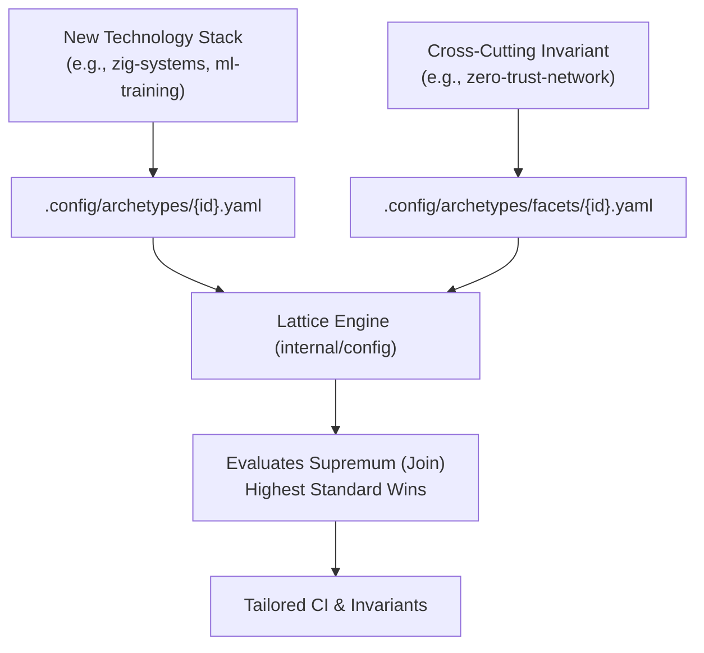

# Archetype and Facet Authoring Guide

Learn how to define new composable profiles and cross-cutting security/operational facets in `cordanaLLM/praetor`.



---

## 0. The shipped catalog

Fourteen profiles ship in `.config/archetypes/`:

`app-service` · `closed-private` · `container-image` · `framework` · `gitops-infra` ·
`library-client` · `native-gpu-systems` · `org-health` · `os-image` · `pages-site` ·
`planning-artifacts` · `template-seed` · `upstream-fork` · `web-package`

Six facets ship in `.config/archetypes/facets/`.

**A profile is not a flavor.** A profile says what governance applies; a flavor says which templates,
settings and toolchains the language stack requires. Only four profiles currently have any flavor
implementing them — `app-service`, `framework`, `native-gpu-systems` and `container-image`. For the
other ten, `flavor audit` reports **not applicable** rather than measuring the repository against an
inferred language flavor, which is correct: `os-image` describes what a repository builds, not what
it is written in.

Two profiles are worth reading before writing a new one, because their correctness looks like a
mistake:

- **`upstream-fork`** declares every complexity bound as `0` and disables linear history and signed
  commits. A contribution fork must match the upstream it submits to, so a gate that rewrites the
  tree makes every patch unmergeable. The looseness is the feature.
- **`org-health`** requires one approving reviewer rather than two despite its blast radius, because
  the repositories that need it are the least maintained ones and a two-approval rule on a
  repository nobody watches is how it goes stale.

## 1. Profile Definition Anatomy
Profiles represent the primary technology stack or architecture. Create `.config/archetypes/{profile-id}.yaml`:

```yaml
id: "native-gpu-systems"
name: "Native GPU & Compute Systems"
description: "High-performance C/C++/Rust/Vulkan systems with deterministic memory bounds"
runtime: "native"

complexity:
  max_cyclomatic: 10
  max_cognitive: 12
  max_func_loc: 75
  max_statements: 40

memory:
  zero_frame_malloc: true
  banned_alloc_in_ticks: true

linters:
  - "clang-tidy"
  - "clippy"
  - "semgrep"

devcontainer_features:
  - "ghcr.io/devcontainers/features/rust:1"
  - "ghcr.io/devcontainers/features/common-utils:2"
```

---

## 2. Facet Definition Anatomy
Facets are cross-cutting policy modifiers. Create `.config/archetypes/facets/{facet-id}.yaml`:

```yaml
id: "security:high"
name: "High-Security Provenance & Hardening"
description: "SLSA Level 3 attestations, keyless Cosign signatures, and non-root execution"

supply_chain:
  slsa_level: 3
  enforce_cosign: true
  require_sbom: true

branch_protection:
  enforce_linear_history: true
  require_signed_commits: true
  required_approving_reviewers: 2
  dismiss_stale_reviews: true
```

---

## 3. The Strictness Lattice ("Highest Standard Wins")
When two profiles or facets define conflicting parameters, the monotonic supremum is calculated:
$$\mathcal{P}_{\text{resolved}} = \mathcal{P}_1 \sqcup \mathcal{P}_2 \sqcup \dots \sqcup \mathcal{F}_n$$
- Lower complexity limits win ($\min$).
- Greater security reviews and higher SLSA levels win ($\max$).
- Linters and container features form a deduplicated set union ($\cup$).

