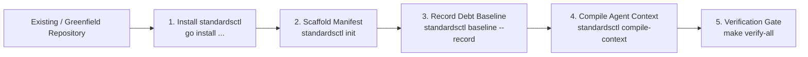

# Repository Onboarding Guide: cordanaLLM/praetor

Onboard any existing or new repository into the cordanaLLM declarative governance fleet.



---

## Flavor detection does not guess

Detection reports what matched, or reports that nothing did. It no longer falls back to a plausible
answer, because a repository that matched nothing was previously indistinguishable from one that is
a Go library.

- A declared profile **narrows** detection: candidates are restricted to the flavors implementing
  that profile, and detection picks among those. Where the profile has no flavors, `flavor audit`
  reports not applicable.
- `python-ml` requires a declared machine-learning dependency. It previously fired on any
  `pyproject.toml`, so every Python repository was reported as a PyTorch pipeline and then audited
  against ML tooling it had no reason to install.
- `agentic-autonomous` never auto-detects and must be selected by name. Its markers — `.agents/` and
  `.paperclip/harness.json` — are both written by adoption itself, so detecting on them describes
  the governance tool rather than the repository.
- Where nothing matches, `flavor audit` and `flavor apply` refuse with `ErrNoFlavorMatched` instead
  of scoring the repository against a flavor that describes nothing about it. Pass `--flavor=<name>`
  to audit against one deliberately.


## 1. Quickstart Onboarding Command
Execute the single-shot onboarding pipeline in your repository root:
```bash
# 1. Initialize configuration with declared profiles
praetorctl init --profile framework --facets security:high,api:public-contract

# 2. Transpile universal agent harness (AGENTS.md -> CLAUDE.md, Cursor, etc.)
praetorctl compile-context

# 3. Snapshot legacy technical debt infractions to prevent CI failure
praetorctl baseline --record

# 4. Prepare a portable devcontainer from reviewed Praetor sources
praetorctl devcontainer generate --source-root /path/to/reviewed/praetor

# 5. Verify 100% compliance
praetorctl audit
```

---

## Planning-only adoption through MCP

`standards_adopt` accepts `profile` and comma-separated `facets`, matching the
CLI's `--profile` and `--facets` selection. For example:

```json
{"path":"/workspace/project","source_root":"/workspace/praetor","profile":"planning-artifacts","facets":"agent:sandboxed","record_baseline":false,"dry_run":true}
```

Both paths must be allowed by the server's existing root policy. Inspect the
preview, then use the same selection with `dry_run: false` for an authorized
application. Omitted or empty selection retains the shared adoption defaults;
an empty facet string does not clear them. The adapter accepts at most 64
comma-separated entries and 8192 facet bytes, with a 128-byte profile bound.
The shared pinned catalog validates selected identities. Existing repository
configuration retains its normal preservation/force semantics.

The planning profile prepares governance without inventing Go or Rust manifests.
It does not qualify a native build, boot, release, running DevContainer or agent
activation. Those stages need their own selected checks and execution evidence.

## 2. Onboarding Workflow Stages

| Step | Action | Command | Expected Output |
| :--- | :--- | :--- | :--- |
| **1. Scaffolding** | Create declarative `.standards.yaml` | `praetorctl init` | `.standards.yaml` created with selected profiles. |
| **2. Context Transpilation** | Generate vendor agent files | `praetorctl compile-context` | `CLAUDE.md`, `.cursor/rules/*.mdc`, etc. created ($< 300$ LOC). |
| **3. Brownfield Baselining** | Snapshot legacy debt | `praetorctl baseline --record` | `.standards-baseline.json` populated with existing debt. |
| **4. Devcontainer Setup** | Prepare a portable bootstrap | `praetorctl devcontainer generate --source-root /path/to/reviewed/praetor` | JSON and exact source companions prepared; build and startup remain separate checks. |
| **5. Audit Verification** | Final compliance sweep | `praetorctl audit` | Score: 100% Compliance. |

---

## 3. Brownfield Technical Debt Ratcheting
Legacy infractions recorded in `.standards-baseline.json` will not fail CI status checks:
- **Monotonic Ratchet**: Technical debt must decrease over time ($V_{\text{total}}(t_1) \le V_{\text{total}}(t_0)$).
- **Touched-File Clean Rule**: Any legacy file modified during a pull request revokes previous exemptions and must be refactored clean.
- **Waivers**: For unavoidable architectural exceptions, mint an Ed25519-signed waiver in `.standards-waivers.yaml`.
