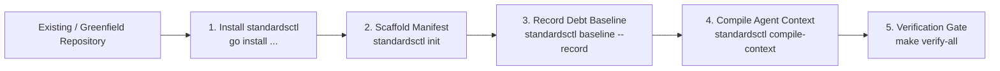

# Repository Onboarding Guide: cordanaLLM/standards

Onboard any existing or new repository into the cordanaLLM declarative governance fleet.



---

## 1. Quickstart Onboarding Command
Execute the single-shot onboarding pipeline in your repository root:
```bash
# 1. Initialize configuration with declared profiles
standardsctl init --profile framework --facets security:high,api:public-contract

# 2. Transpile universal agent harness (AGENTS.md -> CLAUDE.md, Cursor, etc.)
standardsctl compile-context

# 3. Snapshot legacy technical debt infractions to prevent CI failure
standardsctl baseline --record

# 4. Generate hermetic devcontainer
standardsctl devcontainer generate

# 5. Verify 100% compliance
standardsctl audit
```

---

## 2. Onboarding Workflow Stages

| Step | Action | Command | Expected Output |
| :--- | :--- | :--- | :--- |
| **1. Scaffolding** | Create declarative `.standards.yaml` | `standardsctl init` | `.standards.yaml` created with selected profiles. |
| **2. Context Transpilation** | Generate vendor agent files | `standardsctl compile-context` | `CLAUDE.md`, `.cursor/rules/*.mdc`, etc. created ($< 300$ LOC). |
| **3. Brownfield Baselining** | Snapshot legacy debt | `standardsctl baseline --record` | `.standards-baseline.json` populated with existing debt. |
| **4. Devcontainer Setup** | Build isolated container | `standardsctl devcontainer generate`| `.devcontainer/devcontainer.json` synthesized. |
| **5. Audit Verification** | Final compliance sweep | `standardsctl audit` | Score: 100% Compliance. |

---

## 3. Brownfield Technical Debt Ratcheting
Legacy infractions recorded in `.standards-baseline.json` will not fail CI status checks:
- **Monotonic Ratchet**: Technical debt must decrease over time ($V_{\text{total}}(t_1) \le V_{\text{total}}(t_0)$).
- **Touched-File Clean Rule**: Any legacy file modified during a pull request revokes previous exemptions and must be refactored clean.
- **Waivers**: For unavoidable architectural exceptions, mint an Ed25519-signed waiver in `.standards-waivers.yaml`.

