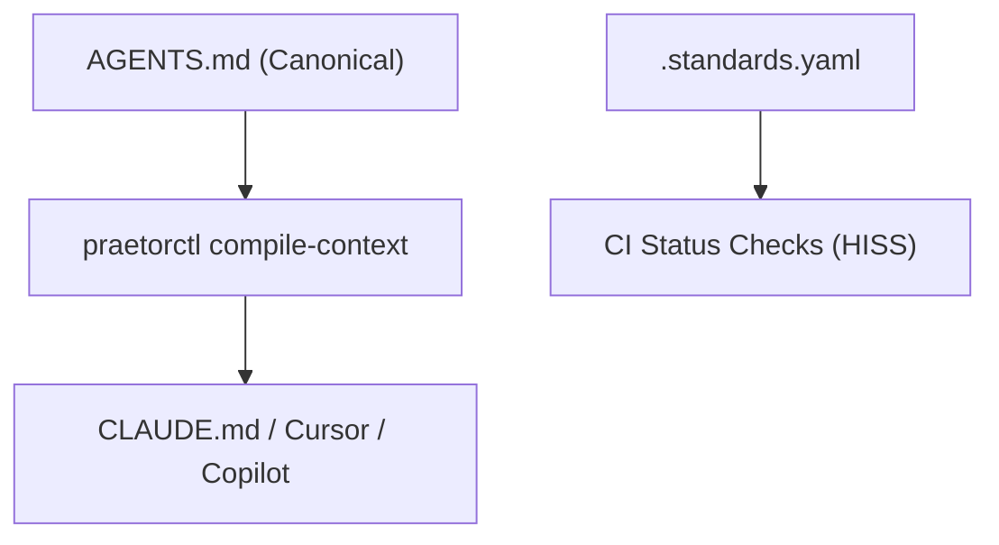

# cordanaLLM/praetor Documentation

Welcome to the official documentation portal for `cordanaLLM/praetor`.

## Architecture Overview

## Highlights

- **High-Integrity Systems Standard (HISS)**: Aerospace-derived software invariants.
- **Composable Lattice Architecture**: Highest standard wins deterministic join-semilattice.
- **SEO & Search Optimized**: Automated sitemaps, JSON-LD Schema.org metadata, and zero CLS styling.
