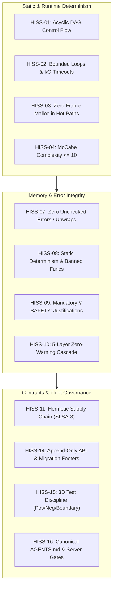

# The High-Integrity Systems Standard (HISS-16)

The definitive formal specification for deterministic software engineering and autonomous agent governance across the cordanaLLM fleet.

The invariants below are policy requirements. Their implemented coverage and
remaining proof gaps are recorded in the [HISS refinement audit](../research/hiss-rule-refinement.md);
a passing scanner does not establish every invariant for every language.

---

## 1. Mathematical Formalism & Core Invariants

### HISS-01: Acyclic Control Flow (Banned Recursion)
Call graphs must form a Directed Acyclic Graph (DAG):
$$G = (V, E), \quad \forall v \in V, \, (v, v) \notin E^*$$
Direct and mutual recursion are strictly prohibited in production runtimes. All iterative algorithms must use bounded stacks or explicit iteration.

### HISS-02: Bounded Loops & Mandatory I/O Timeouts
Every loop construct must possess a compile-time statically verifiable scalar upper bound:
$$\forall \text{loop} \, L, \quad \exists N_{\max} \in \mathbb{N} \quad \text{s.t.} \quad \text{iterations}(L) \le N_{\max}$$
Unbounded `for {}` or `while (true)` loops without static counter termination are rejected. All network and filesystem I/O operations must accept and enforce explicit `context.Context` deadlines.

### HISS-03: Zero Frame Malloc (Deterministic Memory)
Hot simulation loops and rendering ticks (e.g. 60Hz/120Hz pipelines) must maintain zero dynamic heap allocations:
$$\Delta \text{HeapAlloc}_{\text{tick}} = 0$$
Memory must be pre-allocated during subsystem initialization. Any dynamic heap allocation detected during a frame loop causes immediate test failure.

### HISS-04: Complexity Bounds & Modular Sizing
Functions must remain strictly bounded in complexity and scope:

| Metric | Upper Bound | Enforcement Tool |
| :--- | :--- | :--- |
| **McCabe Cyclomatic Complexity** | $\le 10$ | `gocyclo` / `clippy` / `semgrep` |
| **Cognitive Complexity** | $\le 15$ | `gocognit` / `sonar` |
| **Function Length** | $\le 75$ LOC | AST Scanner |
| **Executable Statements** | $\le 50$ Statements | Compiler AST |

---

## 2. Memory Safety, Error Handling & Static Verification

### HISS-07: Checked Errors & Zero Unwrap
Production software must never panic or unwrap:
- Total ban on Rust `.unwrap()` and `.expect()` in non-test code.
- Total ban on unchecked Go error returns (`_ = doSomething()`).
- All error flows must handle the error or wrap it with domain context.

### HISS-08: Static Determinism & Banned Functions
Dynamic runtime code evaluation is strictly banned:
- Total ban on `eval()`, `exec()`, and dynamic string compilation.
- Total ban on insecure C runtime functions (`gets`, `strcpy`, `sprintf`).

### HISS-09: Reference Safety & Mandatory Safety Proofs
Unsafe pointer arithmetic and memory dereferencing require explicit rationale:
- Any `unsafe` block must be preceded by an explanatory `// SAFETY:` comment proving invariants.
- Missing `// SAFETY:` comments trigger immediate AST check rejection.

### HISS-10: 5-Layer Zero-Warnings Cascade
Warnings are treated as fatal errors across all operational layers:
1. **IDE Layer**: Real-time language server diagnostics (`standards-lsp`).
2. **Pre-Commit**: Fast local Git hooks (`lefthook`).
3. **Pre-Push**: Local test suite and branch audit.
4. **CI Layer**: Multi-platform status checks.
5. **Pre-Apply**: Admission controllers and deployment webhooks.

---

## 3. Supply Chain, Fleet Governance & Testing

### HISS-11: Hermetic Supply Chain
Every dependency manifest must be cryptographically pinned:
- Pinned lockfiles mandatory (`go.sum`, `Cargo.lock`, `pnpm-lock.yaml`).
- Zero floating tags (e.g. `:latest`) in container deployments.
- SLSA Level 3 provenance attestations and Sigstore Cosign signatures verified on all binaries.

### HISS-14: Append-Only ABI & Migration Footers
Public application binary interfaces must evolve safely:
- Public APIs are append-only.
- Any breaking change requires a conventional commit breaking indicator (`!`) and a mandatory `Migration:` footer documenting upgrade instructions.

### HISS-15: 3D Test Discipline
All public methods require three-dimensional test coverage:
1. **Positive Tests**: Assert correct results under valid operational inputs.
2. **Negative Tests**: Assert correct error returns under invalid inputs.
3. **Boundary Tests**: Assert correct handling at numeric, string, and buffer limits ($0, 1, N_{\max}$).
4. **Clean Rule**: Any file modified in a pull request must have all historical debt resolved.

### HISS-16: Agentic Fleet Governance & Server-Side Enforcement
Agent instructions originate from a single canonical source (`AGENTS.md`):
- All vendor harnesses (`CLAUDE.md`, Cursor rules, Copilot) are compiled via `standardsctl compile-context`.
- Authoritative verification executes inside non-root ephemeral sandboxes with cgroup limits and default-deny egress.
- The "## Text Register" block in AGENTS.md is generated from the `register:` section of `.standards.yaml` by `standardsctl compile-context` and verified by `--verify`; hand edits between its markers are reported as drift.
