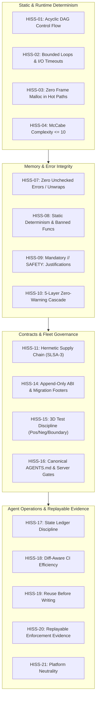

# The High-Integrity Systems Standard (HISS)

The definitive formal specification for deterministic software engineering and autonomous agent governance across the cordanaLLM fleet.

The invariants below are policy requirements. Their implemented coverage and
remaining proof gaps are recorded in the [HISS refinement audit](../research/hiss-rule-refinement.md);
a passing scanner does not establish every invariant for every language.

---

## 1. Mathematical Formalism & Core Invariants

### HISS-01: Acyclic Control Flow (Banned Recursion)

Call graphs must form a Directed Acyclic Graph (DAG):
$$G = (V, E), \quad \forall v \in V, \, (v, v) \notin E^*$$
Direct and mutual recursion are strictly prohibited in production runtimes. All iterative algorithms must use bounded stacks or explicit iteration.

### HISS-02: Bounded Loops & Mandatory I/O Timeouts

Every loop construct must possess a compile-time statically verifiable scalar upper bound:
$$\forall \text{loop} \, L, \quad \exists N_{\max} \in \mathbb{N} \quad \text{s.t.} \quad \text{iterations}(L) \le N_{\max}$$
Unbounded `for {}` or `while (true)` loops without static counter termination are rejected. All network and filesystem I/O operations must accept and enforce explicit `context.Context` deadlines.

### HISS-03: Zero Frame Malloc (Deterministic Memory)

Hot simulation loops and rendering ticks (e.g. 60Hz/120Hz pipelines) must maintain zero dynamic heap allocations:
$$\Delta \text{HeapAlloc}_{\text{tick}} = 0$$
Memory must be pre-allocated during subsystem initialization. Any dynamic heap allocation detected during a frame loop causes immediate test failure.

### HISS-04: Complexity Bounds & Modular Sizing

Functions must remain strictly bounded in complexity and scope:

| Metric | Upper Bound | Enforcement Tool |
| :--- | :--- | :--- |
| **McCabe Cyclomatic Complexity** | $\le 10$ | `gocyclo` / `clippy` / `semgrep` |
| **Cognitive Complexity** | $\le 15$ | `gocognit` / `sonar` |
| **Function Length** | $\le 75$ LOC | AST Scanner |
| **Executable Statements** | $\le 50$ Statements | Compiler AST |

**Function Length** is measured over the body: from the line carrying the opening brace to the line carrying the closing brace, both counted. The signature is not part of the measurement, so a definition written `int f(void)` / `{` on two lines is exactly as long as the same definition written `int f(void) {` on one, and a signature wrapped across a long parameter list -- the ordinary shape of a GPU kernel -- adds nothing to the count. A brace-delimited scanner may still recognise a function from its signature line, which is how it names one whose brace is elsewhere; recognition and measurement are separate. Reformatting must never move a function across the cap.

---

## 2. Memory Safety, Error Handling & Static Verification

### HISS-07: Checked Errors & Zero Unwrap

Production software must never panic or unwrap:

- Total ban on Rust `.unwrap()` and `.expect()` in non-test code.
- Total ban on unchecked Go error returns (`_ = doSomething()`).
- All error flows must handle the error or wrap it with domain context.
- Abort policy: library code returns an error instead of ending the process. The scanner reports
  Go `panic` and `os.Exit`; Rust `panic!`, `todo!`, `unimplemented!`, `unreachable!`,
  `process::exit` and `process::abort`; and Python `sys.exit`. Tests and binary entry points may
  abort: Go `main.main`, a top-level Rust `fn main`, and the Python `if __name__ == "__main__":`
  block or top-level `def main`. The assert family and exit wrappers such as `log.Fatal` are
  recorded as gaps in [`.config/hiss/coverage.yaml`](https://github.com/cordanaLLM/praetor/blob/main/.config/hiss/coverage.yaml), not
  enforced.

### HISS-08: Static Determinism & Banned Functions

Dynamic runtime code evaluation is strictly banned:

- Total ban on `eval()`, `exec()`, and dynamic string compilation.
- Total ban on insecure C runtime functions (`gets`, `strcpy`, `sprintf`).

### HISS-09: Reference Safety & Mandatory Safety Proofs

Unsafe pointer arithmetic and memory dereferencing require explicit rationale:

- Any `unsafe` block must be preceded by an explanatory `// SAFETY:` comment proving invariants.
- Missing `// SAFETY:` comments trigger immediate AST check rejection.

### HISS-10: 5-Layer Zero-Warnings Cascade

Warnings are treated as fatal errors across all operational layers:

1. **IDE Layer**: Real-time language server diagnostics (`standards-lsp`).
2. **Pre-Commit**: Fast local Git hooks (`lefthook`).
3. **Pre-Push**: Local test suite and branch audit.
4. **CI Layer**: Multi-platform status checks.
5. **Pre-Apply**: Admission controllers and deployment webhooks.

---

## 3. Supply Chain, Fleet Governance & Testing

### HISS-11: Hermetic Supply Chain

Every dependency manifest must be cryptographically pinned:

- Pinned lockfiles mandatory (`go.sum`, `Cargo.lock`, `pnpm-lock.yaml`).
- Zero floating tags (e.g. `:latest`) in container deployments.
- SLSA Level 3 provenance attestations and Sigstore Cosign signatures verified on all binaries.

### HISS-14: Append-Only ABI & Migration Footers

Public application binary interfaces must evolve safely:

- Public APIs are append-only.
- Any breaking change requires a conventional commit breaking indicator (`!`) and a mandatory `Migration:` footer documenting upgrade instructions.

### HISS-15: 3D Test Discipline

All public methods require three-dimensional test coverage:

1. **Positive Tests**: Assert correct results under valid operational inputs.
2. **Negative Tests**: Assert correct error returns under invalid inputs.
3. **Boundary Tests**: Assert correct handling at numeric, string, and buffer limits ($0, 1, N_{\max}$).
4. **Clean Rule**: Any file modified in a pull request must have all historical debt resolved.

### HISS-16: Agentic Fleet Governance & Server-Side Enforcement

Agent instructions originate from a single canonical source (`AGENTS.md`):

- All vendor harnesses (`CLAUDE.md`, Cursor rules, Copilot) are compiled via `standardsctl compile-context`.
- Every line outside a `## <Vendor>` heading is shared by all targets. A `## <Vendor>` section (`Claude Code`, `Cursor`, `GitHub Copilot`, `Windsurf`, `Gemini`, `Codex`) compiles into that target alone and is removed from the other five, so one agent's guidance never reaches another.
- Authoritative verification executes inside non-root ephemeral sandboxes with cgroup limits and default-deny egress.
- The "## Text Register" block in AGENTS.md is generated from the `register:` section of `.standards.yaml` by `standardsctl compile-context` and verified by `--verify`; hand edits between its markers are reported as drift.

---

## 4. Agent Operations & Replayable Evidence

### HISS-17: State Ledger Discipline

Every agent turn maintains the local `.workingdir` ledger rather than re-deriving state from scratch:

- Turn start reads `praetorctl state status` (a bounded summary) and the open tasks in `.workingdir/OPEN.md`; the whole `.workingdir/STATE.md` is never read at turn start.
- In-flight work is tracked via `standardsctl state task add` / `complete` / `archive`, never held only in an agent's own working memory.
- Turn end runs `standardsctl state sync .`, which records working-tree status, dirty count, open tasks and a cryptographic state hash into `STATE.md`.
- The whole `.workingdir` directory is private and Git-ignored; reviewed, sanitized material is published under `docs/` instead.

### HISS-18: Diff-Aware CI Efficiency

CI pipelines evaluate the git diff before choosing which gates to run:

- `standardsctl ci filter` classifies a change and exports the gates it requires.
- A docs-only or session-state-only change skips the heavy race detector and security suites; every other change keeps full invariant coverage.
- A gate that is skipped by classification is distinct from a gate that fails: the filter's decision is itself part of the recorded evidence.

### HISS-19: Reuse Before Writing

One behavior has exactly one implementation:

- Before writing a function, config loader, parser or command, the repository is searched for the capability first; an existing implementation is extended or called rather than reimplemented.
- Configuration formats are held to the same rule: a second config system beside an existing loader is the same defect, because the two silently drift apart.
- `praetorctl dedupe scan .` enforces this with function-level clone and utility-sprawl detection, run by `make dedupe` inside `verify-all`. Any clone *or* sprawl finding fails the scan: a finding the verdict does not carry is a finding nobody resolves.
- The clone key renames a function's parameters, receiver, results and locals by first use before hashing (`cloneKey` in `internal/dedupe/dedupe.go`), so a copy whose locals were renamed still matches, while a body that reads a different local or field does not. Bodies under three statements or five printed lines are not hashed.
- `praetorctl dedupe cadence` makes a sweep due after 20 commits, or once 1,000 Go production lines or 10 Go production files have been added since the recorded sweep, whichever comes first (`--threshold`, `--added-lines`, `--added-files`; `CheckCadence` in `internal/dedupe/cadence.go`).
- Duplication that is genuinely unavoidable is justified in the commit body, not left silent.

### HISS-20: Replayable Enforcement Evidence

A claim of coverage is reproducible, never merely asserted:

- Every enforcement claim in `.config/hiss/coverage.yaml` is replayed against a fixture corpus by `praetorctl hiss coverage --verify`, run inside `verify-all`.
- The check runs in both directions: a claim of enforcement must reproduce each of its positive fixtures, and a claim of absence must leave its gap fixtures undetected.
- A rule that silently *gains* coverage fails the gate exactly as one that silently loses it, so the catalog cannot drift in either direction undetected.

### HISS-21: Platform Neutrality

A repository's gates, hooks and generated templates run on Linux, macOS and Windows, or declare the platform they require and skip with a stated reason where it is absent:

- A gate has exactly two acceptable states: running, with its result standing as the platform's result; or skipped, with the reason printed and the alternate coverage source named.
- A check that silently does not run and reports success is prohibited — see the [Platform Neutrality invariant](hiss-21-platform-neutrality.md) for the incident history and enforcement detail.
- Enforced by the Platform Neutrality matrix in CI.
