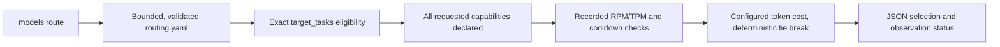

# Declared-task model routing

`praetorctl models route` makes an offline selection from
`.config/models/routing.yaml`. It filters by declared task and model capabilities,
checks recorded capacity where supplied, and minimizes configured token cost.
It does not dispatch an agent or call a provider. Prices, capabilities and task
assignments are operator declarations, not measured quality or current availability.

## Current execution path



The CLI calls `LoadRoutingConfigContext`, optionally `LoadUsageSnapshot` and
`TrackerFromSnapshot`, then `ModelCapacityArbiter.SelectForTask`. This is a real
consumer of the Go router. There is no MCP route tool or scheduler dispatch
connection in this slice. The older `SelectModel` tier-cascade and
`SelectOrthogonalAuditor` helpers still exist, but have no production consumer.
They do not establish that a running agent harness enforces their policies.

## Select a declared task

Run from the Praetor checkout:

```bash
go run ./cmd/standardsctl models route \
  --task=feature_implementation --input-tokens=1000 --output-tokens=500
```

`--config` selects another routing file. `--capabilities` accepts a comma-separated
list of required labels. Every requested label must appear in that model's
`capabilities` list; a missing list grants no capabilities. No model ID, family,
parameter count or historical benchmark score implies eligibility. The existing
catalog has task assignments but no per-model capability declarations, so a
capability-constrained request requires explicit configuration first.

The task must occur in a tier's `target_tasks`. All models in all tiers explicitly
declaring that task are considered. A cheaper model in an undeclared tier remains
ineligible, including a tier named by the legacy `fallback_tier` field. No eligible
candidate is an error, never a silent downgrade or automatic escalation.

For eligible candidates the configured estimate is:

```text
cost_per_m_in * input_tokens / 1,000,000
  + cost_per_m_out * output_tokens / 1,000,000
```

Both prices must be explicit finite nonnegative numbers. Explicit zero is allowed;
missing or null rates cannot win as free models. Rates must use a common currency
or unit; no currency conversion is implemented. At least one token estimate must
be positive. Equal estimates resolve by lexicographic model ID, then tier name,
independently of map or list iteration order.

The JSON result includes the exact loaded configuration SHA256, selected model,
task/capabilities, token estimates, configured cost and capacity observation status.
This work does not update the repository's existing model IDs, task presets or
rates. An existing zero rate is a declaration, not proof that the endpoint exists
or that running it has no resource cost.

## Explicit capacity observations

Without `--usage`, the CLI uses an empty in-process tracker and reports
`capacity_source: "unobserved"`, `capacity_observed: false`, with no recorded
headroom value. This is a provisional selection; no live quota was observed.

To use actual observations collected separately:

```bash
go run ./cmd/standardsctl models route \
  --task=feature_implementation --input-tokens=1000 --output-tokens=500 \
  --usage=/path/to/observed-usage.json
```

A snapshot is a JSON object with exactly these fields:

| Field | Required data |
| --- | --- |
| `version` | Integer `1` |
| `captured_at` | Nonzero RFC3339 timestamp of the observations |
| `models` | Object keyed by configured model IDs |
| Each model's `current_rpm` | Explicit nonnegative integer request counter |
| Each model's `current_tpm` | Explicit nonnegative integer token counter |

A model observation may also include nonnegative `total_spend`, nonnegative integer
`error_count`, and RFC3339 `last_429_time`. Those fields must use their exact names.
Duplicate keys, field-name aliases, unknown fields/models, null observations and
missing counters fail. Do not fill absent observations with invented zeroes.
When `--usage` is supplied, unobserved models cannot be selected. Programmatic
callers obtain the same behavior with `TaskRequest.RequireObservedCapacity`.

The existing capacity calculation uses the larger recorded RPM/TPM utilization
ratio, subtracts it from one, and clamps exhausted capacity to zero. A configured
zero RPM or TPM limit disables that dimension; it does not prove an unlimited
provider quota. A candidate needs positive headroom at least
`1 - exhaustion_threshold_percent/100`. A recorded 429 triggers the existing
30-second cooldown. Fully exhausted or cooling models remain ineligible even at
an exhaustion threshold of 100 percent.

These are historical counter checks. Snapshot timestamps are exposed, but neither
freshness nor rolling-window expiry is inferred. The requested token estimate is
used for cost; it is not projected into capacity or reserved. `total_spend` and
`error_count` do not produce a latency, success-rate or error-rate score. Tracker
updates are thread-safe; selection is not an atomic quota reservation.

## Bounds and configuration migration

Configuration and snapshot files must be regular files no larger than 1 MiB.
Routing accepts version 1, up to 16 tiers, 64 models per tier, 64 task/capability
labels per list, 256 bytes per name and 1,024 snapshot model entries. Model IDs are
globally unique. Each token estimate is bounded at 1,000,000,000; that is an input
safety bound, not an asserted model context-window limit. Overflowing cost
calculations fail. Reads and task selection accept caller cancellation.

Migration: the shared loader used by `models list` and `models route` now rejects
missing/null prices, unknown fields, duplicate IDs/tags, unsupported versions,
invalid bounds and nonregular input paths. Provide both numeric cost fields for
each model, remove misspelled/unknown keys, and use a regular config file. Existing
shipped routing data and `models sync` output already include both prices. This
shared validation prevents listing one ambiguous file as free while routing treats
it differently. Programmatically constructed task-routing descriptors must set
`CostRatesDeclared` when both configured rates are intentional.

## Remaining dispatch and feedback work

Automatic agent dispatch, concurrency reservations, projected quotas, observed
latency/success feedback, quality calibration, retry/escalation policy and
cross-model review orchestration remain unimplemented integrations. The declared
`max_concurrent_same_model` and `orthogonal_audit_required` settings do not establish
scheduler enforcement. The standalone `.config/agent/hooks/pre_agent_dispatch.py`
script has no verified hook registration here; this command does not invoke it.

`models list` displays routing configuration. The separate `models sync` path
serializes a built-in catalog and can query configured local Ollama/vLLM endpoints.
It is not called by `models route`. There is no implemented upstream gateway
pricing synchronization or `.config/models/catalog.json` writer in this path.
Future work must connect execution and real observation sources explicitly before
claiming live fanout or evidence-driven escalation.
