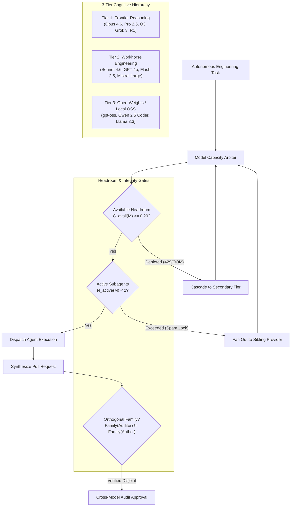

# Multi-Model Dynamic Fanout & Cognitive Routing Architecture

Formal specification for intelligent cognitive capacity balancing, tier-governed task dispatch, and automated model catalog synchronization across the cordanaLLM fleet.

---

## 1. The 3-Tier Cognitive Hierarchy

Autonomous engineering agents must not spam a single model endpoint or exhaust Tier 1 subscription allowances on mechanical tasks. Model dispatch is strictly stratified into three operational tiers:

| Tier | Primary Role | Qualified Architectures | Failure Escalation |
| :--- | :--- | :--- | :--- |
| **Tier 1: Frontier** | System architecture, formal proofs, complex refactoring, final root-cause analysis | `claude-opus-4.6`, `gemini-2.5-pro`, `o3-high`, `grok-3-deep`, `deepseek-r1` | Fallback to Tier 2 Workhorse |
| **Tier 2: Workhorse** | Code synthesis, AST refactoring, unit test generation, CI debugging | `claude-sonnet-4.6`, `gpt-4o-latest`, `gemini-2.5-flash`, `mistral-large-2411` | Fallback to Tier 3 OSS |
| **Tier 3: Open OSS** | Linting sweeps, docstrings, formatting, local pre-commits, secret scans | `gpt-oss-120b`, `qwen2.5-coder-32b`, `llama-3.3-70b-instruct`, `deepseek-v3` | Queue locally on vLLM/Ollama |

---

## 2. Dynamic Cognitive Headroom Formulation

The Model Capacity Arbiter dynamically computes available execution headroom $C_{\text{avail}}(M) \in [0, 1]$ before granting task dispatch:

$$C_{\text{avail}}(M) = \max\left(0, \, \min\left(1 - \frac{\text{RPM}_{\text{active}}(M)}{\text{RPM}_{\text{limit}}(M)}, \, 1 - \frac{\text{TPM}_{\text{active}}(M)}{\text{TPM}_{\text{limit}}(M)}\right) \times \left(1 - \text{ErrorRate}_{5\text{m}}(M)\right)\right)$$

### Operational Thresholds
1. **Nominal Band ($C_{\text{avail}} \ge 0.40$)**: Unrestricted task dispatch up to concurrency limits.
2. **Constrained Band ($0.20 \le C_{\text{avail}} < 0.40$)**: Rate-limited scheduling; low-priority tasks degraded to lower tier.
3. **Depletion Trigger ($C_{\text{avail}} < 0.20$ or HTTP 429)**: Immediate fallback cascade; model quarantined for 60 seconds.

---

## 3. Pre-Agent Dispatch Anti-Spamming Lock

To prevent runaway loops from monopolizing API quotas or flooding a single frontier model, the pre-dispatch hook (`.config/agent/hooks/pre_agent_dispatch.py`) enforces strict concurrency quotas:

$$\forall M \in \text{Catalog}, \quad N_{\text{concurrent\_subagents}}(M) \le 2$$

When a parent agent attempts to spin out multiple subagents targeting identical model identifiers:
1. The first 2 subagents execute on Model $M_1$.
2. Subagent 3 is automatically rerouted to the highest-headroom alternative within the same cognitive tier (e.g., diverting `claude-sonnet-4.6` to `gemini-2.5-flash` or `gpt-4o`).
3. If all tier siblings exceed concurrency caps, tasks are fanned out to zero-cost local inference (`gpt-oss`, `qwen2.5-coder`).

---

## 4. Orthogonal Cross-Model Auditing

Self-review within the same model family produces systematic cognitive blind spots. HISS-16 mandates orthogonal model auditing for code review and verification:

$$\text{Family}(\text{Auditor}) \ne \text{Family}(\text{Author})$$

| Author Model Family | Banned Reviewer Families | Permitted Reviewer Families |
| :--- | :--- | :--- |
| **Anthropic** (`claude-*`) | Anthropic | OpenAI (`o3`, `gpt-4o`), Google (`gemini-*`), Open OSS (`deepseek-*`, `qwen-*`) |
| **OpenAI** (`gpt-*`, `o*`) | OpenAI | Anthropic (`claude-*`), Google (`gemini-*`), Open OSS (`deepseek-*`, `qwen-*`) |
| **Google** (`gemini-*`) | Google | Anthropic (`claude-*`), OpenAI (`o*`), Open OSS (`deepseek-*`, `qwen-*`) |
| **Open OSS** (`qwen-*`, `deepseek-*`) | Open OSS (same weights) | Frontier Tier 1 / Tier 2 Cross-Family |

---

## 5. Automated Catalog Synchronization

Model identifiers, pricing, and context limits drift rapidly. `standardsctl models sync` automates discovery:
- **Upstream Gateway Sync**: Queries configured LiteLLM / OpenRouter model registries for active models, context windows, and cost tiers.
- **Zero-Cost Local Endpoint Discovery**: Probes `http://localhost:11434/api/tags` (Ollama) and `http://localhost:8000/v1/models` (vLLM) to register locally available weights.
- **Lockfile & Schema Reification**: Synchronizes state to `.config/models/catalog.json` and verifies deterministic routing.
