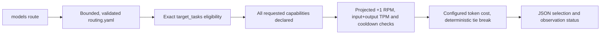

# Declared-task model routing

`praetorctl models route` makes an offline selection from
`.config/models/routing.yaml`. It filters by declared task and model capabilities,
checks projected request capacity against supplied counters and declared limits,
and minimizes configured token cost.
It does not dispatch an agent or call a provider. Prices, capabilities and task
assignments are operator declarations, not measured quality or current availability.

## Current execution path



The CLI calls `LoadRoutingConfigContext`, optionally `LoadUsageSnapshot` and
`TrackerFromSnapshot`, then `ModelCapacityArbiter.SelectForTask`. This is a real
consumer of the Go router. There is no MCP route tool or scheduler dispatch
connection in this slice. The MCP `standards_dogfood_repair_status` tool consumes
the same advisory selection through repair planning, so oversized requests block
repair admission there too. The older `SelectModel` tier-cascade and
`SelectOrthogonalAuditor` helpers still exist, but have no production consumer.
They do not establish that a running agent harness enforces their policies.

## Select a declared task

Run from the Praetor checkout:

```bash
go run ./cmd/standardsctl models route \
  --task=feature_implementation --input-tokens=1000 --output-tokens=500
```

`--config` selects another routing file. `--capabilities` accepts a comma-separated
list of required labels. Every requested label must appear in that model's
`capabilities` list; a missing list grants no capabilities. No model ID, family,
parameter count or historical benchmark score implies eligibility. The existing
catalog has task assignments but no per-model capability declarations, so a
capability-constrained request requires explicit configuration first.

The task must occur in a tier's `target_tasks`. All models in all tiers explicitly
declaring that task are considered. A cheaper model in an undeclared tier remains
ineligible, including a tier named by the legacy `fallback_tier` field. No eligible
candidate is an error, never a silent downgrade or automatic escalation. The same
`target_tasks` label also selects the text register and the optional output budget that
`models route` reports; the register never changes the tier
(see the [text register guide](../guides/text-register.md)).

For eligible candidates the configured estimate is:

```text
cost_per_m_in * input_tokens / 1,000,000
  + cost_per_m_out * output_tokens / 1,000,000
```

Both prices must be explicit finite nonnegative numbers. Explicit zero is allowed;
missing or null rates cannot win as free models. Rates must use a common currency
or unit; no currency conversion is implemented. At least one token estimate must
be positive. Equal estimates resolve by lexicographic model ID, then tier name,
independently of map or list iteration order.

The JSON result includes the exact loaded configuration SHA256, selected model,
task/capabilities, token estimates, configured cost and capacity observation status.
This work does not update the repository's existing model IDs, task presets or
rates. An existing zero rate is a declaration, not proof that the endpoint exists
or that running it has no resource cost.

## Explicit capacity observations

Without `--usage`, the CLI uses an empty in-process tracker and reports
`capacity_source: "unobserved"`, `capacity_observed: false`, with no recorded
headroom value. `quota_limits_known` says whether both configured quota dimensions
are positive. When both are known, `projected_headroom` describes utilization after
the request, using zero as a provisional starting counter when observations are
absent. These fields do not turn an unobserved selection into a live quota claim.

To use actual observations collected separately:

```bash
go run ./cmd/standardsctl models route \
  --task=feature_implementation --input-tokens=1000 --output-tokens=500 \
  --usage=/path/to/observed-usage.json
```

A snapshot is a JSON object with exactly these fields:

| Field | Required data |
| --- | --- |
| `version` | Integer `1` |
| `captured_at` | Nonzero RFC3339 timestamp of the observations |
| `models` | Object keyed by configured model IDs |
| Each model's `current_rpm` | Explicit nonnegative integer request counter |
| Each model's `current_tpm` | Explicit nonnegative integer token counter |

A model observation may also include nonnegative `total_spend`, nonnegative integer
`error_count`, and RFC3339 `last_429_time`. Those fields must use their exact names.
Duplicate keys, field-name aliases, unknown fields/models, null observations and
missing counters fail. Do not fill absent observations with invented zeroes.
When `--usage` is supplied, unobserved models and models lacking a positive RPM or
TPM limit cannot be selected. Programmatic callers obtain the same behavior with
`TaskRequest.RequireObservedCapacity`.

Admission adds one request and the sum of both token estimates before checking
each known limit against `exhaustion_threshold_percent`. At 80 percent, 7 recorded
requests against a 10 RPM limit admits one more; 8 does not. Similarly, 700 recorded
tokens against a 1,000 TPM limit admits 60 input plus 40 output tokens, but rejects
60 plus 41. Integer additions are checked before mutation, and threshold comparisons
use the exact configured numeric value without rounding large counters through
floating point. Headroom floats are diagnostics only.

A configured zero RPM or TPM limit disables that dimension in provisional
selection; it does not prove an unlimited provider quota. A recorded 429 triggers
the existing 30-second cooldown. Fully exhausted or cooling models remain
ineligible even at an exhaustion threshold of 100 percent. Orthogonal selection
uses the configured threshold and requires positive headroom.

These are historical counter checks. Snapshot timestamps are exposed, but neither
freshness nor rolling-window expiry is inferred. `total_spend` and `error_count`
do not produce a latency, success-rate or error-rate score. Advisory selection uses
one coherent tracker snapshot and does not reserve anything.

## Atomic reservations within a process

The Go API adds `arbiter.ReserveForTask(ctx, request) (*TaskReservation, error)` and
`tracker.FinishReservation(reservation, actual) error`. A successful reservation
selects and charges +1 RPM, estimated input+output TPM, and configured cost under
one tracker lock. It enforces a positive `max_concurrent_same_model`; zero means
reservation concurrency has not been configured and fails. Active reservations
also affect advisory selection and headroom reads. Share the same `LimitTracker`
between dispatchers and keep their routing configuration immutable while in use.

The opaque handle's `Route()` returns a detached description. Every successful
reservation must be finished, including failed or cancelled dispatches; defer the
cleanup in the owning runner and finish only after execution has actually stopped.
Admission cancellation and declined requests write no counters or handles.
Finishing does not require a context, so a cancelled request can still release its
slot. No background task, provider request or expiry timer is started by this API.

Pass `&router.ReservationUsage{Tokens: actualTokens, Cost: actualCost}` when actual
usage is known, including an explicit zero. Completion replaces the estimated
tokens and cost, keeps the one RPM charge, and releases the active slot exactly
once. Pass `nil` when actual usage is unknown: the charge stays conservative and
the slot is released. Do not also call `RecordUsage` for that request; that older
API is for independent consumption. Invalid actual usage leaves the handle active
for correction or a final `nil` completion. Duplicate, copied and foreign handles
are rejected without changing accounting.

Counters created only by estimated charges do not become observations, including
after `nil` completion. `ObservedUsage` returns charged counters plus a boolean
indicating whether supplied or actual usage exists; that boolean does not certify
every charge as measured. A lone 429 event records cooldown, not measured quota
counters. Accounting overflow saturates the affected counter,
blocks subsequent admission for that model, releases the finishing slot and returns
an explicit error. Later completions cannot reclaim saturated accounting. Legacy
`RecordUsage` cannot wrap counters or reopen a blocked model.

One tracker admits at most 1,024 active handles and cannot add new reservation model
identities beyond 1,024 tracked models. Counters are cumulative until a caller
deliberately builds a new tracker from independent observations. No automatic
reset is safe while reservations remain active. Separate processes, trackers or
CLI invocations do not share this state: this is not fleet persistence, provider
availability checking, or scheduler integration. `models route` remains advisory.

## Maintain the catalog with models sync

`praetorctl models sync` merges the built-in seed list into `routing.yaml`. With
discovery on, which is the default, it also adds the models installed on a local
Ollama endpoint, so a model you pull becomes routable.

```bash
praetorctl models sync                         # seed list plus this machine's Ollama models
praetorctl models sync --discover-local=false  # seed list only; no daemon needed
praetorctl models sync --prune                 # rebuild from the seed list and this run's discovery
```

Discovery queries only endpoints on port 11434 (Ollama); the default
`http://localhost:8000` vLLM endpoint is accepted but not queried. An Ollama endpoint
that does not answer fails the command, so pass `--discover-local=false` on a machine
without a daemon.

Each model entry records who owns it in `source`:

| `source` | Written by | What a sync does with it |
| :--- | :--- | :--- |
| `seed` | the seed list in `internal/router/sync.go` | rewrites it in place from the seed list |
| `local` | discovery against a local Ollama endpoint | keeps it; a rediscovered ID is never added twice |
| absent | an operator editing the file | keeps it |

Without `--prune`, a sync never removes an entry. Entries the seed list does not own
stay in their tier and order, and tiers the defaults do not define stay with their
descriptions and task labels. An installed model that is also a seed entry keeps its
seed entry instead of appearing twice. If a sync would still lose an entry, which
happens when the seed list drops a model the catalog marks `source: seed`, it writes
nothing and exits with an error that lists the IDs and names `--prune`.

`--prune` is the explicit rebuild. The result holds the seed list plus what this run
discovered, and the command prints each removed ID. Run it with discovery on, on the
machine whose models the catalog should list; otherwise it removes every `local`
entry.

A catalog that does not load, for example with a duplicate ID or an unknown `source`
value, is refused rather than overwritten; repair or delete it first. The write is
bound to the bytes the sync read: `contextopt.ReplaceSnapshot` checks them again
before replacing the file, so an edit made while the sync runs fails it instead of
being lost, apart from a writer that races that final check. The default tiers'
descriptions and task labels and the
`governance` block are still rewritten from the built-in defaults on every sync.
The behavior is pinned by `internal/router/sync_test.go` and
`cmd/standardsctl/models_sync_test.go`.

### Nightly catalog check

`.github/workflows/sync-models.yml` runs the offline sync every night and fails when
the result differs from the tracked catalog, which means a seed-list change landed
without a regenerated `routing.yaml`. The job has read-only repository access and
never commits. `main` requires a pull request, signed commits and passing checks with
no bypass actor, so a bot push cannot land there, and this repository does not let
`GITHUB_TOKEN` open pull requests. To clear the failure, run `praetorctl models sync`
and land the result in a pull request.

## Bounds and configuration migration

Configuration and snapshot files must be regular files no larger than 1 MiB.
Routing accepts version 1, up to 16 tiers, 64 models per tier, 64 task/capability
labels per list, 256 bytes per name and 1,024 snapshot model entries. Model IDs are
globally unique. Each token estimate is bounded at 1,000,000,000; that is an input
safety bound, not an asserted model context-window limit. Overflowing cost
calculations fail. Reads and task selection accept caller cancellation.

Migration: the shared loader used by `models list` and `models route` now rejects
missing/null prices, unknown fields, duplicate IDs/tags, unsupported versions,
invalid bounds and nonregular input paths. Provide both numeric cost fields for
each model, remove misspelled/unknown keys, and use a regular config file. Existing
shipped routing data and `models sync` output already include both prices. This
shared validation prevents listing one ambiguous file as free while routing treats
it differently. Programmatically constructed task-routing descriptors must set
`CostRatesDeclared` when both configured rates are intentional.

Migration: model entries accept an optional `source` field whose only values are
`seed` and `local`; any other value is rejected. `models sync` now merges instead of
rewriting, and removes entries only with `--prune`. A script that relied on a plain
`models sync` to discard entries must pass `--prune`. A catalog committed with a
duplicate ID, which earlier sync runs could produce by listing an installed seed model
twice, no longer loads; delete the second copy.

Migration: requests that cross a configured RPM/TPM threshold now fail before
selection, including oversized requests against an empty tracker. Supply realistic
token estimates and explicit applicable limits. `--usage` and
`RequireObservedCapacity` additionally require positive limits for both dimensions.
Consumers may read the additive `quota_limits_known` and `projected_headroom`
fields; existing `recorded_headroom` remains the pre-request counter diagnostic.
Dispatch consumers must opt into the reservation API, configure positive concurrency,
and finish every successful handle; calling advisory selection alone does not
enforce concurrency.

## Remaining dispatch and feedback work

Automatic agent dispatch, shared fleet reservations, observed latency/success
feedback, quality calibration, retry/escalation policy and
cross-model review orchestration remain unimplemented integrations. The declared
`orthogonal_audit_required` setting does not establish scheduler enforcement.
The concurrency setting is enforced only by callers using the shared tracker
reservation API. The standalone `.config/agent/hooks/pre_agent_dispatch.py`
script has no verified hook registration here; this command does not invoke it.

`models list` displays routing configuration. The separate `models sync` path
merges a built-in catalog and can query configured local Ollama endpoints (see
[Maintain the catalog with models sync](#maintain-the-catalog-with-models-sync)).
It is not called by `models route`. There is no implemented upstream gateway
pricing synchronization or `.config/models/catalog.json` writer in this path.
Future work must connect execution and real observation sources explicitly before
claiming live fanout or evidence-driven escalation.
