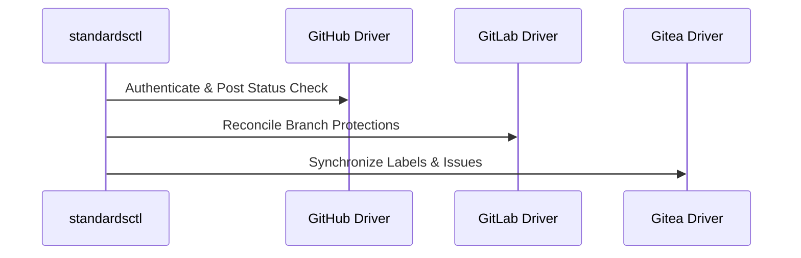

# API & CLI Reference Manual

## standardsctl CLI Commands

- `standardsctl init`: Scaffolds a new .standards.yaml manifest with profiles and facets.
- `standardsctl plan`: Computes the lattice supremum and performs a dry-run drift calculation.
- `standardsctl sync`: Applies declarative standards to branch protections, labels, and CI.
- `standardsctl compile-context`: Transpiles AGENTS.md to CLAUDE.md, Cursor rules, and Copilot.
- `standardsctl baseline`: Records or verifies legacy brownfield technical debt.
- `standardsctl audit`: Validates 100% compliance against the active standards baseline.

## Multi-Forge Federation

