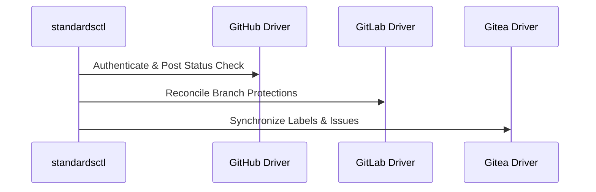

# API & CLI Reference Manual

## standardsctl CLI Commands

- `standardsctl init`: Scaffolds a new .standards.yaml manifest with profiles and facets.
- `standardsctl plan`: Computes the lattice supremum and performs a dry-run drift calculation.
- `standardsctl sync`: Applies declarative standards to branch protections, labels, and CI.
- `standardsctl compile-context`: Transpiles AGENTS.md to CLAUDE.md, Cursor rules, and Copilot.
- `standardsctl baseline`: Records or verifies legacy brownfield technical debt.
- `standardsctl audit`: Validates 100% compliance against the active standards baseline.
- `standardsctl compile-framework-assets --config <kit.yaml> --output <dir>`: Writes a framework kit's `llms.txt`, `llms-full.txt`, `.agents/rules/<kit_name>.md` and starter templates (ADR-0007 clause 5).

### Framework kit assets

`compile-framework-assets` reads one YAML document with the keys `kit_name`, `language`, `version`, `description`, `rules`, `skills` and `components` (the `FrameworkKitConfig` fields in `internal/compiler/framework_assets.go`); any other key is refused. Both flags are required: `--output` has no default, so the fixed asset names never overwrite the working tree's own `llms.txt` by accident.

```yaml
kit_name: sveltesentio
language: svelte
version: 5.0.0
description: Svelte 5 component library
rules: [Use Svelte 5 runes exclusively]
skills: [a11y-debugging]
components: [Button, Modal]
```

`kit_name` names the agent rule file, so it must be one file-name component: 1-64 letters, digits, `.`, `_` or `-`, starting with a letter or digit. Anything else, such as `../x` or `a/b`, fails before any file is written (`TestCompileFrameworkAssets_RejectsUnsafeKitNameBeforeWriting` in `internal/compiler/framework_assets_test.go`).

## Multi-Forge Federation


