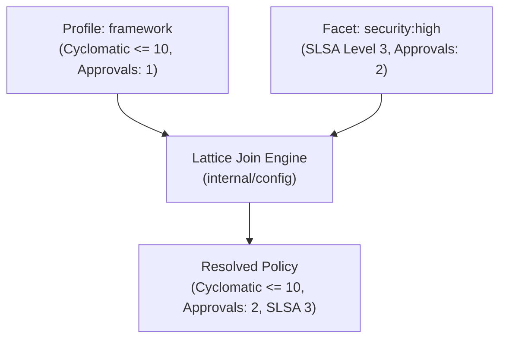

# Composable Archetypes & Strictness Lattice

Repository configuration is modeled as a bounded Join-Semilattice:
$$\mathcal{P}_{\text{resolved}} = \mathcal{P}_1 \sqcup \mathcal{P}_2 \sqcup \dots \sqcup \mathcal{F}_n$$

## Lattice Resolution Rule: "Highest Standard Wins"

- **Complexity Limits**: Evaluated as the greatest lower bound ($\min$).
- **Review Approvals & SLSA**: Evaluated as the least upper bound ($\max$).
- **Linters & Features**: Cumulative deduplicated set union ($\cup$).

