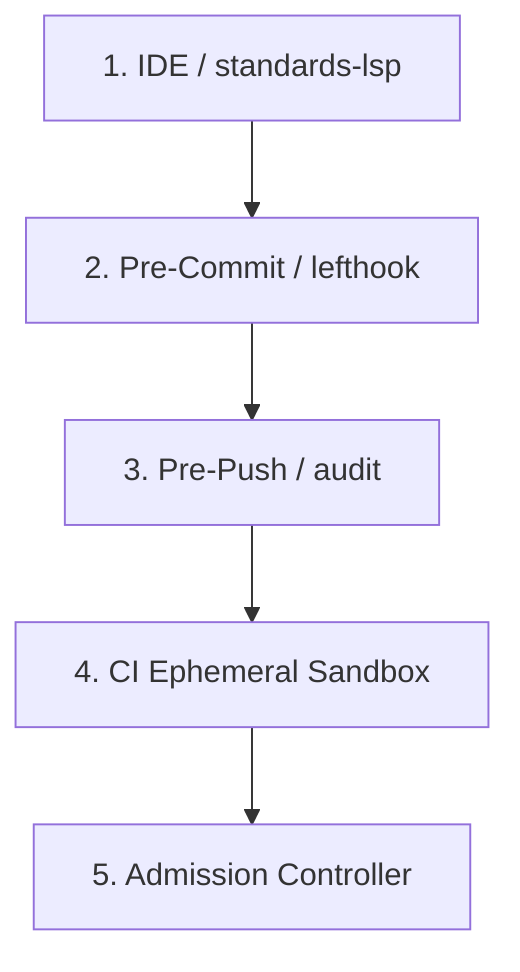

# The High-Integrity Systems Standard (HISS-16)

HISS-16 establishes formal engineering determinism across polyglot repositories.

## Invariant Summary

| Invariant | Scope | Rule | Verification |
| :--- | :--- | :--- | :--- |
| **HISS-01** | Control Flow | Call graph is strictly a Directed Acyclic Graph (DAG); zero recursion. | AST check |
| **HISS-02** | Loops & I/O | Compile-time scalar loop bound; context timeout on all I/O. | Compiler lint |
| **HISS-03** | Memory | Zero dynamic heap allocation in hot-path simulation/render loops. | Alloc sweep |
| **HISS-04** | Complexity | McCabe Cyclomatic $\le 10$, Cognitive $\le 15$, Func LOC $\le 75$. | gocyclo / AST |
| **HISS-07** | Errors | Zero unwrap / expect; all errors handled or wrapped. | Static check |
| **HISS-10** | Hygiene | Zero warning tolerance across compiler, linters, and formatters. | CI gate |
| **HISS-14** | Contracts | Public APIs are append-only; breaking changes require 'Migration:'. | Conventional commit |
| **HISS-15** | Testing | Mandatory 3D tests (Positive, Negative, Boundary) on all public interfaces. | Race test suite |
| **HISS-16** | Context | Single source of truth in AGENTS.md; vendor targets transpiled. | compile-context --verify |

## Zero-Warning Cascade

