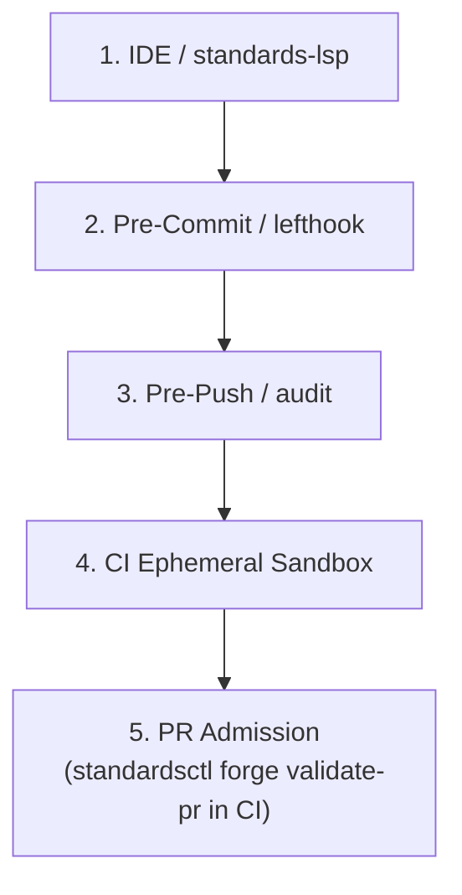

# The High-Integrity Systems Standard (HISS)

HISS establishes formal engineering determinism across polyglot repositories. It defines
21 invariants, HISS-01 through HISS-21; [HISS-Matrix](HISS-Matrix.md) lists every one with its enforcement.
HISS-16 is one of them, the context-integrity invariant, not the name of the standard.

## Gated Invariants

This repository's `AGENTS.md` gates the invariants below. `praetorctl forge sync-wiki`
copies them from its "Core Directives & Invariants" table each time it regenerates this page.

| Invariant | Scope | Rule | Verification | On fail |
| :--- | :--- | :--- | :--- | :--- |
| **HISS-01** | control flow | recursion prohibited; call graph = DAG | build | immediate build failure |
| **HISS-02** | loops, I/O | scalar upper bound on every loop; explicit `context.Context` timeout on every I/O | Semgrep / AST | error |
| **HISS-04** | complexity | McCabe cyclomatic <= 10, cognitive <= 15, func LOC <= 75, statements <= 50 | AST sweep | blocker |
| **HISS-07** | errors | zero `.unwrap()` / `.expect()`; every error handled or wrapped with context | linter / compiler | error |
| **HISS-10** | warnings | zero warnings: compiler, linter, format sweeps | sweep | exit code 1 |
| **HISS-15** | 3D testing | positive + negative + boundary tests mandatory, every public interface | CI coverage gate | blocker |
| **HISS-16** | context integrity | single canonical `AGENTS.md`; vendor files compiled via `standardsctl compile-context`; `AGENTS.md` passes caveman lint | pre-commit | blocker |
| **HISS-17** | state ledger | turn start: `praetorctl state status` + `.workingdir/OPEN.md`, never whole `.workingdir/STATE.md`; tasks via `standardsctl state task`; turn end: `standardsctl state sync .` | pre-commit / CI | gate |
| **HISS-18** | CI efficiency | diff-aware gating; docs/state-only change skips heavy race + security gates via `standardsctl ci filter` | CI | optimization gate |
| **HISS-19** | reuse before writing | one behavior = one implementation; extend or call existing, config formats included | `dedupe scan` in verify-all | gate fail |
| **HISS-20** | replayable evidence | every rule has fixtures replayed both directions; coverage claim reproducible, never asserted | `hiss coverage --verify` in verify-all | gate fail |
| **HISS-21** | platform neutrality | gates, hooks, emitted templates run on Linux, macOS, Windows, or skip with stated reason; gate that cannot run != passing gate | Platform Neutrality matrix in CI | gate fail |

## Zero-Warning Cascade

