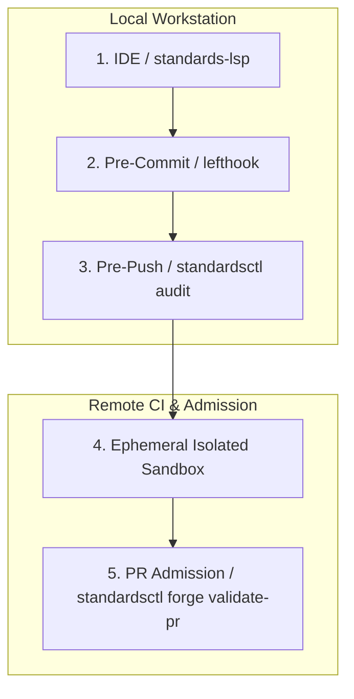

# High-Integrity Systems Standard (HISS-16) Compliance Matrix

The formal specification matrix across the 19 deterministic engineering invariants in `cordanaLLM/praetor`.

| Invariant | Title | Domain | Mathematical Axiom / Threshold | Enforcement Layer | Failure Action |
| :--- | :--- | :--- | :--- | :--- | :--- |
| **HISS-01** | Acyclic Control Flow | Control Flow | $G=(V,E), \forall v, (v,v) \notin E^*$ (DAG) | AST Check / Compiler | Build failure |
| **HISS-02** | Bounded Loops & I/O Timeouts | Execution | $\forall L, \exists N_{\max} \text{ s.t. } \text{iter}(L) \le N_{\max}$ | Semgrep / Static Lint | AST rejection |
| **HISS-03** | Zero Frame Malloc | Memory | $\Delta \text{HeapAlloc}_{\text{tick}} = 0$ | Heap Alloc Sweep | Unit test failure |
| **HISS-04** | Complexity Bounds | Complexity | Cyclomatic $\le 10$, LOC $\le 75$, Stmt $\le 50$ | `gocyclo` / `gocognit` | Pre-push blocker |
| **HISS-05** | Variable Scoping | Memory | Minimum lexical scope | Linter | Compiler warning |
| **HISS-06** | Bounded Concurrency | Concurrency | Explicit worker pool upper bounds | Race detector | CI gate |
| **HISS-07** | Checked Errors | Error Handling | Zero `.unwrap()`, zero unchecked `_ = err` | Static Analyzer | Pre-commit blocker |
| **HISS-08** | Static Determinism | Safety | Ban `eval()`, dynamic code loading, unsafe C | Semgrep | Admission blocker |
| **HISS-09** | Reference Safety | Memory | Mandatory `// SAFETY:` proofs for `unsafe` | AST Scanner | Review blocker |
| **HISS-10** | Zero-Warning Cascade | Hygiene | Zero compiler / linter warning tolerance | `go vet` + `golangci-lint run` (CI) | Exit code 1 |
| **HISS-11** | Hermetic Supply Chain | Security | Cryptographic pinning, SLSA Level 3, Cosign | Attestation Verifier | Deployment rejection |
| **HISS-12** | Secret Leak Prevention | Security | Zero credentials in Git history | `gitleaks` | Push hook failure |
| **HISS-13** | Monotonic Debt Ratchet | Governance | $V_{\text{total}}(t_1) \le V_{\text{total}}(t_0)$ | `standardsctl baseline` | PR status gate |
| **HISS-14** | Append-Only ABI | Architecture | Append-only public contracts; `Migration:` footer | `standardsctl forge check-commits` (CI) | PR merge blocker |
| **HISS-15** | 3D Test Discipline | Quality | Positive + Negative + Boundary tests required | `go test -race` | Coverage gate |
| **HISS-16** | Context Integrity | Agentic Fleet | Single `AGENTS.md` source in the internal register; compiled $< 300$ LOC | `compile-context --verify` (caveman lint included) | Pre-commit blocker |
| **HISS-17** | State Ledger Discipline | Agentic Fleet | Turn starts on `state status` and `OPEN.md` (never all of `STATE.md`), ends on `state sync .` | `praetorctl state sync --verify` | Pre-commit / CI gate |
| **HISS-18** | CI Efficiency | Governance | Docs-only and state-only diffs skip heavy race and security gates | `praetorctl ci filter` | CI optimization gate |
| **HISS-19** | Reuse Before Writing | Maintainability | One behavior, one implementation; configuration formats included | `praetorctl dedupe scan` | Verification gate rejection |

---

## Pull Request Admission

Every pull request is admitted by `standardsctl forge validate-pr`, which requires all three
of the following in the PR description:

1. A checked HISS-16 context-integrity box.
2. A checked HISS-15 3D-testing box.
3. A fenced ` ```receipt ` (or ` ~~~receipt `) block carrying the `.standards-receipt.json`
   envelope produced by `praetorctl gate run`. The block is parsed as JSON, its Ed25519
   signature is verified against `receipt.public_key` pinned in `.standards.yaml`, its
   recorded output hash is checked against the gate output it carries, and its `commit_sha`
   must equal the pull request head. Prose, a bare code block, or the words "Exit-0 Receipt"
   satisfy nothing.

A checked box is a task-list item (`- [x]`, `* [x]`, `1. [x]`); a `[x]` quoted mid-sentence
or inside a code fence is not counted. A description that ends inside an unclosed fence is
rejected, because everything after the opening delimiter renders as code. The rules live in
`internal/forge/pr.go` and are pinned by `internal/forge/pr_template_test.go`.

---

## The Verification Ladder



Layer 5 is the "Validate PR Governance Checklist & Exit-0 Receipts" step in
`.github/workflows/ci.yml`, which runs `standardsctl forge validate-pr` as described under
[Pull Request Admission](#pull-request-admission). No `cordana-standards[bot]` runs any check:
`.config/github-app/manifest.json` specifies that app but nothing provisions it, and
`internal/forge/pr.go` only requests it as a reviewer.
