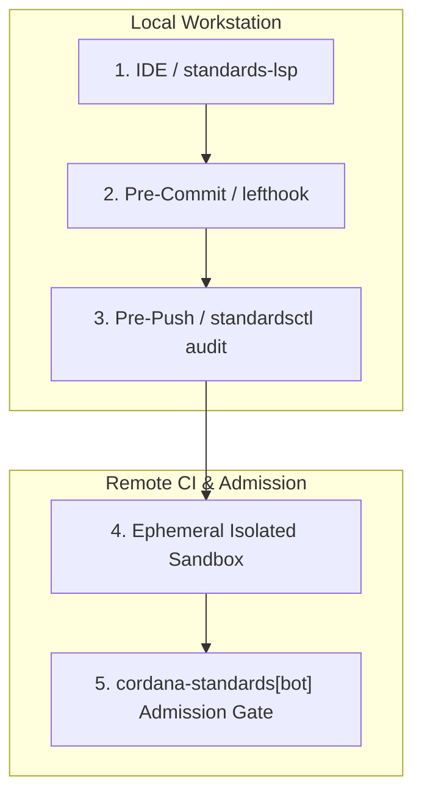

# High-Integrity Systems Standard (HISS-16) Compliance Matrix

The formal specification matrix across the 16 deterministic engineering invariants in `cordanaLLM/standards`.

| Invariant | Title | Domain | Mathematical Axiom / Threshold | Enforcement Layer | Failure Action |
| :--- | :--- | :--- | :--- | :--- | :--- |
| **HISS-01** | Acyclic Control Flow | Control Flow | $G=(V,E), \forall v, (v,v) \notin E^*$ (DAG) | AST Check / Compiler | Build failure |
| **HISS-02** | Bounded Loops & I/O Timeouts | Execution | $\forall L, \exists N_{\max} \text{ s.t. } \text{iter}(L) \le N_{\max}$ | Semgrep / Static Lint | AST rejection |
| **HISS-03** | Zero Frame Malloc | Memory | $\Delta \text{HeapAlloc}_{\text{tick}} = 0$ | Heap Alloc Sweep | Unit test failure |
| **HISS-04** | Complexity Bounds | Complexity | Cyclomatic $\le 10$, LOC $\le 75$, Stmt $\le 50$ | `gocyclo` / `gocognit` | Pre-push blocker |
| **HISS-05** | Variable Scoping | Memory | Minimum lexical scope | Linter | Compiler warning |
| **HISS-06** | Bounded Concurrency | Concurrency | Explicit worker pool upper bounds | Race detector | CI gate |
| **HISS-07** | Checked Errors | Error Handling | Zero `.unwrap()`, zero unchecked `_ = err` | Static Analyzer | Pre-commit blocker |
| **HISS-08** | Static Determinism | Safety | Ban `eval()`, dynamic code loading, unsafe C | Semgrep | Admission blocker |
| **HISS-09** | Reference Safety | Memory | Mandatory `// SAFETY:` proofs for `unsafe` | AST Scanner | Review blocker |
| **HISS-10** | Zero-Warning Cascade | Hygiene | Zero compiler / linter warning tolerance | 5-Layer Cascade | Exit code 1 |
| **HISS-11** | Hermetic Supply Chain | Security | Cryptographic pinning, SLSA Level 3, Cosign | Attestation Verifier | Deployment rejection |
| **HISS-12** | Secret Leak Prevention | Security | Zero credentials in Git history | `gitleaks` | Push hook failure |
| **HISS-13** | Monotonic Debt Ratchet | Governance | $V_{\text{total}}(t_1) \le V_{\text{total}}(t_0)$ | `standardsctl baseline` | PR status gate |
| **HISS-14** | Append-Only ABI | Architecture | Append-only public contracts; `Migration:` footer | AST Diff / Commit lint | PR merge blocker |
| **HISS-15** | 3D Test Discipline | Quality | Positive + Negative + Boundary tests required | `go test -race` | Coverage gate |
| **HISS-16** | Context Integrity | Agentic Fleet | Single `AGENTS.md` source; compiled $< 300$ LOC | `compile-context --verify` | Pre-commit blocker |

---

## The Verification Ladder

