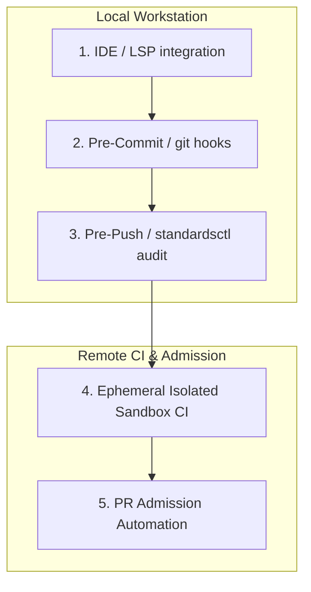

# HISS Compliance Matrix

The High-Integrity Systems Standard (HISS) defines 21 invariants, HISS-01 through HISS-21. This matrix
lists each one for `cordanaLLM/praetor`: its enforcement, its failure action, and whether this
repository's `AGENTS.md` gates it ([HISS-Invariants](HISS-Invariants.md) shows the gated rules). The rows
come from the core HISS rule catalog, the registry the `standards_explain_rule` MCP tool serves.

| Invariant | Title | Gated | Enforcement | Failure action |
| :--- | :--- | :--- | :--- | :--- |
| **HISS-01** | Control Flow - Acyclic DAG Control Flow | yes | AST call-graph analyzer and static linter checks. | Immediate build failure. |
| **HISS-02** | Loops & I/O - Bounded Loops & Mandatory I/O Timeouts | yes | Semgrep rules and AST sweep. | Pre-commit and CI blocker. |
| **HISS-03** | Zero Frame Malloc | no | Heap benchmark allocations gate. | CI failure. |
| **HISS-04** | Complexity Bounds & Modular Sizing | yes | gocyclo, gocognit and funlen via golangci-lint (.golangci.yml), plus the standards_inspect_symbols AST scanner. | Build sweep blocker. |
| **HISS-05** | Variable Scoping | no | NOT ENFORCED. No executable check exists in this repository, and no configured linter decides this rule. | None today; the rule is advisory until a check is attached. |
| **HISS-06** | Bounded Concurrency | no | NOT ENFORCED for the axiom. The race detector cannot observe an unbounded pool: a lock-order inversion or an unbounded but race-free fan-out produces no data race. 'go test -race' runs, but it does not decide this rule. | None today; the rule is advisory until a check is attached. |
| **HISS-07** | Checked Errors & Zero Unwrap | yes | golangci-lint, clippy. | Compiler / linter error. |
| **HISS-08** | Static Determinism & Banned Functions | no | Semgrep rules. | Admission rejection. |
| **HISS-09** | Reference Safety & Mandatory Safety Proofs | no | AST check. | Immediate AST check rejection. |
| **HISS-10** | 5-Layer Zero-Warnings Cascade | yes | Compile and linter flags (-Werror, zero-warning tolerance). | Exit code 1. |
| **HISS-11** | Hermetic Supply Chain | no | CI attestation gate. | Deployment rejection. |
| **HISS-12** | Secret Leak Prevention | no | 'make secrets' runs gitleaks over repository history inside verify-all. | Verification gate rejection. |
| **HISS-13** | Monotonic Debt Ratchet | no | 'praetorctl baseline' and the gate's HISS stage, evaluated against .standards-baseline.json. The scan feeding it refuses to certify a scope it did not fully examine. | PR status gate rejection. |
| **HISS-14** | Append-Only ABI & Migration Footers | no | Git log and API diff analyzer. | PR blocker. |
| **HISS-15** | 3D Test Discipline | yes | CI coverage gate (go test -race -coverprofile with a minimum statement-coverage floor enforced by 'go tool cover') and PR checklist validation of the 3D test attestation. | Merge gate rejection. |
| **HISS-16** | Canonical AGENTS.md & Server Gates | yes | Pre-commit blocker, server-side admission. | Merge blocker. |
| **HISS-17** | State Ledger Discipline | yes | Pre-commit state-sync hook and the CI / pre-push state audit. | Pre-commit / CI gate rejection. |
| **HISS-18** | CI Efficiency | yes | CI filter step exporting run_* outputs that every heavy gate's condition consumes. | CI optimization gate. |
| **HISS-19** | Reuse Before Writing | yes | 'praetorctl dedupe scan .' function-level clone and utility-sprawl detection, run by 'make dedupe' inside verify-all. | Verification gate rejection. |
| **HISS-20** | Replayable Enforcement Evidence | yes | 'praetorctl hiss coverage --verify', run inside verify-all against '.config/hiss/coverage.yaml'. | Verification gate rejection. |
| **HISS-21** | Platform Neutrality | yes | Platform Neutrality matrix in CI. | Verification gate rejection. |

---

## Pull Request Admission

Every pull request is admitted by the repository's configured automation, which requires all three
of the following in the PR description:

1. A checked HISS-16 context-integrity box.
2. A checked HISS-15 3D-testing box.
3. A fenced ` ```receipt ` block carrying the `.standards-receipt.json` envelope produced by
   the local gate. The block is parsed as JSON, its Ed25519 signature is verified
   against `receipt.public_key` pinned in the repository's configuration, its recorded output hash is
   checked against the gate output it carries, and its `commit_sha` must equal the pull
   request head. Prose, a bare code block, or the words "Exit-0 Receipt" satisfy nothing.

---

## The Verification Ladder


```mermaid
flowchart TD
    subgraph Local["Local Workstation"]
        LSP["1. IDE / LSP integration"] --> HOOK["2. Pre-Commit / git hooks"]
        HOOK --> AUDIT["3. Pre-Push / standardsctl audit"]
    end
    subgraph Remote["Remote CI & Admission"]
        AUDIT --> CI["4. Ephemeral Isolated Sandbox CI"]
        CI --> ADMIT["5. PR Admission Automation"]
    end
```

Layer 5 is the PR admission check running in the repository's continuous integration
pipeline. It validates the governance checklist and Exit-0 receipt as described under
[Pull Request Admission](#pull-request-admission). The automation strictly enforces
the HISS matrix requirements on every proposed change.
