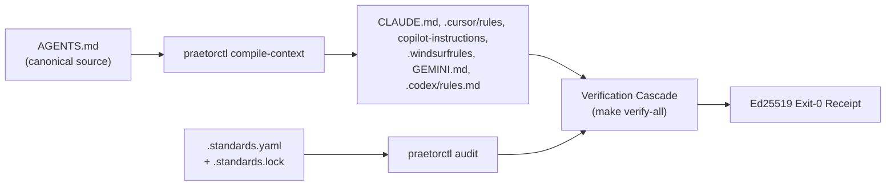

# cordanaLLM/praetor Wiki Portal

Welcome to the official repository governance wiki for cordanaLLM.

## Governance Lifecycle Architecture

## Quick Navigation

| Document | Description |
| :--- | :--- |
| [[HISS-16-Invariants]] | The invariants AGENTS.md gates, with the rule and verification for each. |
| [[Architecture-Lattice]] | Mathematical join-semilattice and Highest Standard Wins resolution. |
| [[API-Reference]] | CLI commands, MCP tools, and multi-forge driver specifications. |
